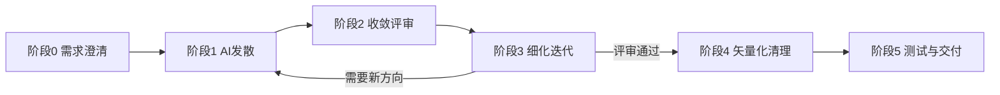

# Logo & 品牌视觉设计工作流

这个 skill 把"用 AI 生图工具快速出 logo 创意"和"专业品牌设计规范"两条知识线拼成一条
可执行的六阶段流水线。核心分工：**AI 生成负责执行层（怎么出图、怎么迭代、怎么转矢量），
设计规范负责判断层（什么样的 logo 才专业、才经得起推敲）**——只靠 AI 随便出图会得到"能看但
不专业"的结果，只靠传统规范讲道理不出图则完全不提效，两者必须结合。



**不是每次都要走满六阶段**：如果用户已经有现成的 logo 草稿/位图想直接清理矢量化，
从阶段 4 开始；如果只是想要几个能直接贴进 AI 工具的提示词，做完阶段 0-1 就可以停下，
不用强行走完矢量化和文档产出。按用户实际请求判断该从哪一步介入、到哪一步为止。

## 阶段 0：需求澄清

不要拿到"帮我设计个 logo"就直接开始生成。先用简短对话或一次性问题收集：

- **品牌名/项目名**，以及名称长短是否适合直接读出（决定 wordmark 还是 lettermark，见
  `references/design-principles-guide.md` 第一章「选型三问」）
- **行业/赛道**、**目标受众**
- **品牌人格**（3-5 个形容词，比如"极客/温暖/克制/前卫"）
- **是否需要文字标**（品牌名本身是否要出现在 logo 里）
- **是否已有需要延续的视觉资产**（旧 logo、品牌色、竞品需要规避的相似元素）
- **交付预期**：只要几个创意方向？还是要走完整矢量化+多尺寸测试+品牌规范文档？

把答案整理成一份结构化简报，作为下一阶段生成提示词的原始素材。

## 阶段 1：AI 发散

**先判断这个会话本身有没有可以直接调用的文生图能力**：用 ToolSearch 查一下
（关键词类似 "generate image" "text to image" "artifact"），如果session里确实挂了图像生成
工具，直接调用它按下面的公式生成多个方向；如果没有（多数 Claude Code 会话是这种情况），
你的产出就是**写好可以直接复制粘贴的提示词**，让用户拿去 Midjourney / GPT-4o / Nano Banana /
Ideogram / Recraft / 即梦AI 等工具生成，用户把结果保存到本地后再回来进入阶段 2。

**工具怎么选**，看 `references/ai-generation-guide.md` 第二章的对比表和场景建议，简单归纳：

- 需要精确渲染品牌文字 → GPT-4o / Ideogram
- 纯图形/图标，想直接拿到真矢量 → Recraft
- 追求创意发散、氛围级灵感 → Midjourney / 即梦AI
- 需要高分辨率/材质细节 → Nano Banana Pro

**提示词公式**（七要素，详细写法原理和逐要素解释见 `references/ai-generation-guide.md`
第三章）：

```
[Flat vector / minimalist / geometric / line-art / mascot] logo for a [行业/品牌语境],
[named "品牌名"（如需文字标，否则省略）],

Subject: a single [核心符号概念],
using [负空间/对称/圆形徽章等构图方式],

Color: [2-3 种具体色系描述],
Background: [pure white background / pure black background]（不要直接写 "transparent"）,
Composition: centered, icon only, clear silhouette, works well at small sizes,

Exclude: no text, no gradients (unless essential), no shadows, no 3D render,
no realistic photo detail, no watermark
（GPT系模型这段放句末陈述句；Midjourney 改写为 --no text --no gradients --no shadows）,

Style anchor（可选，写风格形容词而非品牌名，避免侵权）: [...]
```

一次至少给 3-4 个方向（不同 Subject 或不同 Style），而不是只生成一版就定稿。中文场景下
即梦AI 有独立的提示词套路（文字部分前置），标小智/Pixso 这类模板工具适合不想写长提示词的
用户——具体范例都在 `references/ai-generation-guide.md` 3.4 节，直接抄改字段即可。

## 阶段 2：收敛评审

拿到多个方向后，不要让用户"凭感觉选一个"，用下面的清单逐个打分：

- **类型是否匹配**：Wordmark/Lettermark/Pictorial/Abstract/Mascot/Combination/Emblem
  选得对不对？新品牌/低预算默认应该更倾向 Combination Mark（风险最低）——
  `references/design-principles-guide.md` 第一章
- **是否落入陈词滥调**：地球仪=国际化、灯泡=创意、S形飘带、六边形+渐变漩涡这类高频
  俗套意象——`references/ai-generation-guide.md` 4.9 节有完整清单
- **品牌识别性**：如果是重画/改版已有品牌，有没有丢失关键识别元素
- **颜色数 ≤ 3**、**主体轮廓是否清晰单一**（决定小尺寸下还认不认得出）
- **构图是否对称/平衡**（AI 生成的"近似对称"经常有肉眼可见的偏差）

评审结论不是"选一个"就完事，而是明确指出该方向的问题所在，供阶段 3 针对性迭代；
如果所有方向都不理想，回到阶段 1 重新生成而不是将就凑合。

## 阶段 3：细化迭代

在选定方向内小步调整，而不是每次重新起一个新方向：

- 迭代话术示例："字体太硬朗了，换成更柔和一点的"、"图标能不能再简化一点"、
  "生成一版更适合放在导航栏的横向排布"
- **保持系列一致性**：锁定 Seed + 把满意结果作为参考图传给后续生成 + 固化一段风格关键词
  模板反复复用（`references/ai-generation-guide.md` 4.3 节）
- 不同模型的负面提示词语法不一样（Midjourney `--no`、GPT 系放句末陈述、Ideogram 用
  negative prompt 字段），别把一种语法套到所有模型上，具体速查表见
  `references/ai-generation-guide.md` 3.3 节

## 阶段 4：矢量化清理

用户把定稿的位图存到本地后，用 `scripts/vectorize.py` 处理（脚本会先用 Pillow 把
AI 出图常见的几百个杂色/微渐变色块收敛成几个纯色块，再交给 vtracer/potrace 描摹，
避免直接描出几千个锚点的臃肿路径）：

```bash
# 多色扁平图形（默认量化成6色）
python3 scripts/vectorize.py input.png -o logo-color.svg --mode color --colors 6

# 单色线稿/纯图标（用于生成纯黑版）
python3 scripts/vectorize.py input.png -o logo-black.svg --mode mono
```

脚本跑完会报告一个大致的锚点数，超过 800 说明还需要继续简化——要么调低 `--colors`、
调高 `--filter_speckle`，要么提示用户在 Illustrator 里手动跑一次「路径 > 简化」。

拿到黑色版之后，用 `scripts/recolor.py` 直接从矢量文件派生纯白反白版（不用重新生图/重新
描摹）：

```bash
python3 scripts/recolor.py logo-black.svg -o logo-white.svg --color "#FFFFFF"
```

这一步同时要对照 `references/design-principles-guide.md` 的判断层规则做人工修正指导，
而不只是"把路径描干净"：

- 对称元素只精细修一侧，镜像复制生成另一侧，不要让描摹结果两侧独立走形
- 如果 logo 含文字，AI 描出来的字形笔画不规范，应建议换成真实字体重新排版转曲，而不是
  直接用描摹结果
- 线宽统一成一档或最多两档

## 阶段 5：测试与交付

用 `scripts/size_preview.py` 生成"多尺寸 x 多背景"联系表，检查小尺寸下是否糊成一团、
在深/浅背景上对比度是否够：

```bash
python3 scripts/size_preview.py -o contact-sheet.png \
  --variant "全彩版:logo-color.svg:#FFFFFF" \
  --variant "纯黑版:logo-black.svg:#FFFFFF" \
  --variant "反白版:logo-white.svg:#1A1A2E" \
  --sizes 16,32,48,128,512
```

检查要点：16/32px 格子里轮廓是否还能一眼认出；如果认不出，说明这个方向本身对小尺寸场景
不友好，应该回到阶段 2/3 简化主体元素，而不是在这一步硬修。

**最终交付物**（默认组合，按用户实际预算/需求增减）：

- 矢量母版：全彩 SVG + 纯黑 SVG + 纯白反白 SVG
- Favicon 套件：16/32/48/180/192/512px
- 一份迷你品牌规范文档：复制 `assets/brand-guideline-template.md`，按实际内容填充
  占位符（安全间距默认 0.5X、印刷最小尺寸默认 20-25mm、数字最小尺寸默认 60-80px 等
  默认值来自 `references/design-principles-guide.md` 第九章"适合写成硬性规则的规范"，
  没有特殊理由不要改动这些默认值；黄金比例网格构造这类"经验法则"则可以按项目调整，
  但要如实标注这是可调整项）

如果 AI 生成过程涉及具体品牌重画/商用场景，提醒用户过一遍
`references/ai-generation-guide.md` 5.4 节的商标检索和版权风险自查清单，但不要代替用户
做法律结论。

## 参考文件

- `references/design-principles-guide.md` —— 判断层：logo 类型选择、几何网格构造、
  安全间距与最小尺寸、色彩规范、字体规范、14 类误用禁忌、交付物与格式规范、品牌手册
  文档结构，附硬性规则/经验性建议的区分（第九章）
- `references/ai-generation-guide.md` —— 执行层：AI 绘图工具对比、提示词公式与模板、
  常见翻车点与规避、矢量化与商用化处理流程
- `assets/brand-guideline-template.md` —— 迷你品牌规范文档模板
- `scripts/vectorize.py` —— 位图转矢量清理（vtracer 彩色 / potrace 单色）
- `scripts/recolor.py` —— 从已有矢量/位图派生纯色版本（用于生成黑白反白版）
- `scripts/size_preview.py` —— 多尺寸 x 多背景可用性测试联系表
