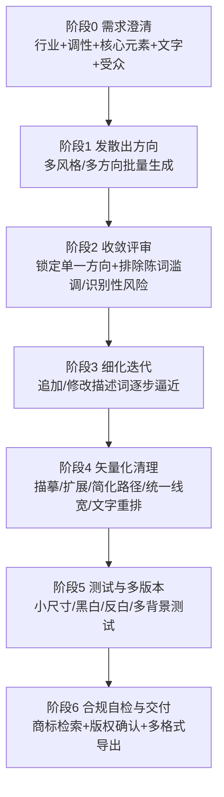

# AI 生成 Logo 参考文档

> 本文档整合自 5 份调研笔记（中文社媒经验贴与教程套路 / 主流 AI 绘图工具能力对比 / 提示词公式与模板 / 矢量化与商用化处理流程 / 常见问题与规避方法），目的是为编写「指导 AI（Claude）设计 Logo」的技能文档（Skill）提供可直接复用的知识基础。文末附「给 skill 设计者的建议」，说明本文档应如何与另一份「传统 Logo 设计规范」调研（网格、留白、色彩、字体、误用禁忌）结合，形成完整的 skill 工作流。

---

## 一、整体工作流程概览

多篇中英文教程（标小智、Pixso、GPT-4o 教程、即梦AI 教程、logotouse.com、VectoSolve 等）虽然措辞不同，但归纳出的流程高度一致，可以固化为 **六阶段闭环**，而不是指望"一次提示词就出可交付成品"：



**各阶段要点**：

1. **需求澄清**——先确定"设计类型 + 行业属性 + 品牌名/文字 + 情绪/理念"，不要直接甩一个词就生成。这一步应输出后续提示词七要素（见第三章）的原始素材。
2. **发散出方向**——用 Midjourney/即梦AI/Nano Banana 等一次生成多张（4 宫格或多风格模板），先看"感觉对不对"，不要在一个方向上死磕。标小智等模板工具直接提供"选风格 → 套模板"作为发散的简化替代。
3. **收敛评审**——挑中一个方向后，通过追加/修改描述词（材质、排布、字体感、颜色）迭代，而不是每次重新起一个新方向。常用迭代话术示例（GPT-4o 教程）：
   - "字体太硬朗了，可以换成更柔和、手写感一点的字体"
   - "图标的叶子能不能再小一点"
   - "请再生成一版横向排布的版本，适合用于网站导航栏"
4. **细化迭代**——同一方向内持续小步调整，直到主体轮廓（silhouette）清晰、色彩克制、复杂度可控。
5. **矢量化清理**——AI 出的都是位图，落地必须走矢量化 + 人工清理（详见第五章）。
6. **测试与合规自检**——小尺寸可读性测试、黑白/反白/多背景测试、商标近似检索、AI 工具服务条款核查，最后导出多格式交付（详见第四、五章）。

---

## 二、工具选型对比

### 2.1 综合能力对比表

以下按「文字渲染准确度 / 扁平矢量 vs 写实倾向 / 透明背景与抠图 / 矢量化转SVG能力 / 使用方式与价格」五个维度横评，是选型的核心依据（数据截至 2026 年中调研）：

| 工具 | 文字渲染准确度 | 扁平矢量 vs 写实倾向 | 透明背景/抠图 | 矢量化/转SVG | 使用方式与价格（概况） |
|---|---|---|---|---|---|
| **Midjourney**（v7/v8.1） | 弱–中等，短句尚可、长/复杂文字仍常出错（准确率约40%，落后于Ideogram约95%） | 默认偏写实/艺术插画，需强提示词才扁平 | 不原生支持，需内置Editor擦除导出或外部remove.bg | 无原生SVG，需第三方矢量化 | Discord/官网订阅，$10–$120/月，无免费额度 |
| **GPT-4o / gpt-image-1**（OpenAI） | 强，官方"逐字母拼写"技巧可进一步提升准确率 | 默认偏精致/写实，需显式要求 flat/no gradient/no shadow | **原生支持**，提示词直接要求 transparent PNG 即可（带 alpha 通道） | 无原生SVG | ChatGPT内或API，约$0.011–$0.167/张（视质量档），gpt-image-1 将于 2026-10-23 停用被 1.5/2 替代 |
| **Google Nano Banana / Nano Banana Pro**（Gemini 3） | **强**，多语言/长文本清晰，官方主推 logo 场景 | 可控但默认也偏精致，需显式约束扁平化 | 支持透明背景生成+局部编辑 | 无原生SVG，第三方工作流可接矢量化 | Gemini App/AI Studio/API，免费额度较慷慨（App每天约3张Pro画质），4K约$0.15/张 |
| **Ideogram**（3.0/4.0） | **最强之一**，约90–95%，"Design"模式专为排版优化 | 天然偏图形化/扁平（Poster/Vector/Logo风格） | **内置一键去背景**，可直接生成透明背景 | 无原生SVG，常与Recraft组合完成矢量化 | 官网/App，免费每周10 credits（结果公开），Plus $16/月起、Pro $48/月 |
| **Recraft**（V3/V4） | 中等（可调用内置Ideogram模型补强） | **原生擅长扁平矢量/图标**，专门训练方向 | 内置一键抠图去背景 | **原生真矢量SVG直出**（当前唯一），另有独立"AI Vector Generator"（文生矢量）和"AI Image Vectorizer"（位图转矢量） | 官网，免费每天约30–50 credits，Basic $10/月起、Pro Premium $48/月 |
| **Adobe Firefly**（Text-to-Vector） | 图片模块尚可，**矢量模块文字仍不稳定**，建议手动补字体 | 矢量模块天然扁平（理解锚点/贝塞尔曲线） | 联动Photoshop/Illustrator抠图，体验成熟 | **原生矢量直出**（另一个真SVG选项）+ Illustrator Image Trace / "Concept to Vector" | 网页版/Illustrator内，免费每月25 credits，Standard $9.99起，企业API另计 |
| **即梦 AI（Jimeng）** | 中等，中文场景友好，英文精细排版非强项；社区反馈"即使指定'宋体'，输出也不一定是宋体" | 依赖提示词精细控制，非天然强项 | **智能画布内置智能抠图**（画笔/套索微调、批量抠图），中文用户体验好 | 无原生矢量，需第三方转换工具 | App/官网，免费每天60–100积分，会员¥79–¥649/月 |
| **可灵 AI（Kling）** | **较弱**，官方/评测均指出图片文字融合能力不足 | 偏"风格延展/场景应用"而非扁平图标生成 | 未见专门功能说明 | 无原生矢量 | App/官网，积分/订阅制，价格未细化 |
| **Stable Diffusion + Logo LoRA** | 弱（需专用文字LoRA缓解），仍不稳定 | **风格自由度最高**，社区有大量logo/flat专用LoRA可选（Logo Maker 9000 SDXL、FLUX.1-dev-LoRA-Logo-Design） | 非原生，需插件/外部工具 | 部分工作流可导出SVG，但门槛高 | 本地部署免费（需GPU）或第三方算力平台按量付费，技术门槛最高 |
| **标小智 / Pixso 等"模板+AI"一体化工具** | 模板化，中文体验好 | 依赖预设模板，创意自由度低于纯Midjourney/GPT-4o | 视具体模板而定 | **自带在线编辑（改字体/颜色/排版）+一键导出SVG等矢量文件** | 官网，选风格即出图，无需写长prompt，适合非设计师 |
| **（辅助）Vectorizer.ai / Illustrator Image Trace / Potrace / VTracer** | 不适用（不生成图，仅转换） | 不适用 | 不适用 | **专职矢量化**：位图→SVG/EPS/DXF/PDF，是任意无原生矢量输出的AI生图工具的通用"最后一公里"补丁 | 见第五章工具对比表 |

### 2.2 场景化选型建议

没有一个工具能同时做到"文字准确 + 天然扁平矢量 + 透明背景 + 原生SVG"四项全占，实践中最优解通常是**组合工作流**：

- **纯图形/图标类 logo（无文字或文字简单）** → **Recraft**（直接拿真矢量SVG）。
- **含精确品牌文字的 wordmark** → **Ideogram** 或 **Nano Banana Pro / GPT-4o**（文字准）→ 再丢给 **Recraft / Vectorizer.ai** 矢量化。
- **需要透明背景素材直接可用** → 优先 **GPT-4o**（提示词要求 transparent PNG）或 **Ideogram**（一键去背）或 **Recraft**（剪刀工具），避免 Midjourney（无原生透明通道）。
- **想要"logo 应用到产品场景"的效果图/延展**（马克杯、包装、门头） → 可灵 O1、即梦AI 的画布/延展能力更合适，而不是从 0 生成 logo 本身。
- **追求创意发散、氛围级灵感** → Midjourney/即梦AI，但"目前可能还不能直接做成品，仅适合初步草图/开拓思路"。
- **追求精确文字与版式控制、专业商用场景** → GPT-4o/GPT Image、Ideogram、Nano Banana Pro。
- **追求一站式易用、非设计师、想直接拿可交付矢量文件** → 标小智/Pixso 类模板工具。
- **追求高分辨率与材质细节** → Nano Banana Pro（原生支持 1K–4K 输出）。
- **追求极致风格定制、零成本、能接受较高技术门槛** → Stable Diffusion + 专用 LoRA。

补充判断依据：

- Midjourney "非常依赖 prompt 质量，需要不断开盲盒"，对新手不友好；标小智/Pixso 等模板化工具更省心但创意上限较低——这是"创意自由度"与"确定性"之间的权衡，应根据用户的设计经验判断推荐哪一类工具。
- 2026 年新版本模型（Ideogram、Nano Banana Pro、GPT-image 系）文字渲染能力提升很快，已基本解决"英文短词拼写正确"问题，但复杂中文/生僻字/超长文案仍需二次校验或人工替换字体。

---

## 三、提示词公式与模板

### 3.1 通用七要素公式

多个中英文来源（logotouse.com、superside.com、socialsight.ai、标小智、即梦AI 教程）总结出的公式高度一致，可归纳为：

```
[品牌名/行业语境] + [核心符号 Subject] + [图形风格 Style] + [构图方式 Composition]
+ [色彩描述 Color] + [背景要求 Background] + [排除项 Exclusions] + [输出参数/参考锚点]
```

即梦AI 教程给出的更细拆解版本：**风格定位 + 核心元素 + 排版颜色 + 细节要求**，或 **行业属性 + 材质工艺 + 情感氛围**；标小智版本更偏模板化：**设计类型 + 行业属性 + Logo 特点（核心元素）+ 配色方案 + 情绪/理念内涵 + 设计风格**。

**关键约束原则（所有版本一致强调）**：风格只选一种、符号只选一个概念、颜色限制在 2–3 种以内。这是控制输出质量、避免"堆砌形容词导致视觉混乱"的核心手段——AI 模型对复杂构图的控制力有限，符号越单一，主体轮廓越清晰，logo 在缩小到 favicon 尺寸时才依然可识别。

### 3.2 逐要素拆解：写法 + 原理

| 要素 | 写法建议 | 为什么这样写 |
|---|---|---|
| **主体元素 Subject** | 只给一个具体符号概念，如 `minimal geometric abstract node symbol`、`geometric coffee cup or bean icon inside a circle badge` | 概念堆砌是五大失败原因之一；符号越单一，主体轮廓越清晰，缩小后越可识别 |
| **图形风格 Style** | `flat vector`、`minimalist`、`geometric`、`line art`、`monoline`、`mascot`、`emblem`、`lettermark` | "vector"一词会把模型的视觉语言拉向路径感、色块清晰边缘，便于后期矢量化；"flat/minimalist"强制删除阴影渐变，保证小尺寸可辨认 |
| **构图方式 Composition** | `negative space`、`symmetry`、`circular badge/emblem`、`centered composition`、`single silhouette` | 负空间技巧（如FedEx箭头、WWF熊猫）更耐看有记忆点；圆形徽章带来"专业稳定"调性；元素数量≤3有助于小尺寸可读性 |
| **色彩描述 Color** | 限定2–3种颜色，用具体色系描述而非"colorful"，如 `deep navy and electric blue`，进阶可加十六进制色号 | 印刷工艺限制（丝网印刷通常仅支持约4–8色）；颜色越少品牌识别度越高、越容易在黑白/单色场景下正常使用 |
| **背景要求 Background** | 推荐 `pure white background`（或额外生成一张 `pure black background` 版本），避免直接写 `transparent` | 当前主流模型输出的是纯RGB像素，没有alpha通道概念，直接要求"transparent"往往被模型用棋盘格/灰色去"模拟"透明；更稳妥的做法是白/黑双底图后用程序化差分法或抠图工具提取真正透明通道 |
| **排除项 Exclusions** | `no text`、`no gradient`、`no shadow`、`no 3D`、`no realistic photo detail`、`no watermark` | AI把文字当作像素形状学习而非语言符号，直接生成的文字几乎必出错；行业标准做法是先只生成图形（no text），文字后期用专业排版软件加真实字体 |
| **参考锚点 Style Anchor** | 引用设计师姓名/流派而非具体品牌，如 `by Paul Rand`、`Bauhaus geometric style`，避免 `like Nike` | 直接点名品牌会显著提高商标近似/侵权风险；应把"像哪个品牌"翻译成形容词化的品牌调性描述（如把"像某运动品牌的对勾"改写为 `bold dynamic swoosh, energetic motion, athletic brand feel`） |

### 3.3 模型语法差异速查

| 模型 | 是否支持独立负面提示 | 排除项写法 | 文字渲染能力 | 备注 |
|---|---|---|---|---|
| Midjourney | 支持 `--no` 参数 | `--no text --no gradients --no shadows --no watermark` | 差，几乎必出乱码 | 可加 `--ar 1:1`、`--style raw`、`--s`（风格化权重）、`--q`（质量）等参数 |
| GPT-image（4o/gpt-image-1/2） | **不支持**独立字段 | 只能用自然语言，且**必须放在 prompt 末尾**（放开头容易被当成构图指引而非排除项） | 中等，短词有时可用但不稳定，官方建议对生僻词逐字母拼写提升准确率 | 也不支持真正alpha透明，需用pure white/black底图技巧 |
| Ideogram | 支持 negative prompt 字段 | 常规负面词即可 | **强**，目前文字渲染最好的模型之一 | 需要文字时把文字放进英文引号 `"..."` 中，控制在 ≤6 词最稳，可指定字重/字体气质如 `tall serif`、`screen-print texture` |

### 3.4 可直接套用的完整提示词范例

**范例一：GPT-4o 结构化模板（可直接复制替换字段）**

```
Create image 专业 logo 设计图：
- 设计风格：采用苹果设计美学（简约、精致、高端）
- 背景要求：纯白色
- 主色调：亮天蓝色系
- 行业定位：人工智能/科技
- Logo 文字："LangGPT"
- 传达理念：语言、创新、智能、可靠
- 设计元素：简洁几何形状，可融入抽象的 AI/语言相关元素
- 技术规格：高分辨率，确保文字清晰易读
```

使用方法：替换品牌名/行业/理念信息后直接喂给 GPT-4o 一步生成；进阶做法是先用一个"Logo 设计智能体"把用户的模糊需求转成更精准的提示词。

**范例二：英文完整提示词——科技/AI 品牌（七要素公式实例化）**

```
Flat vector logo for a tech AI company called "Novar", minimal geometric abstract node symbol, deep navy and electric blue, simple shapes, no gradients, white background, centered icon, professional logo design.
```

**范例三：英文完整提示词——精品咖啡品牌（徽章式构图）**

```
Minimalist emblem logo for an artisan coffee brand, geometric coffee cup or bean icon inside a circle badge, warm brown and cream, flat vector, clean negative space, no text, no shadow.
```

**范例四：GPT-image 风格完整写法（正向表述为主、排除项放句末）**

```
Design a flat, vector-style logo for "Field & Flour", a local bakery. Brand personality: warm, simple, timeless. Use clean geometric shapes, strong silhouette, balanced negative space, so it reads clearly at both small and large sizes. Warm wheat-gold and deep brown color palette, centered composition on a pure white background. Flat design, minimal strokes, no gradients unless essential, no shadows, no watermark, no text.
```

**范例五：中文提示词（标小智/即梦AI 风格，可直接套用）**

```
3D 玻璃质感风格：<关键词>，3D 图标，等距，渐变色玻璃质感，多彩配色，<关键词>背景，3D 渲染，C4D，blender

日式极简风格：<关键词>标志性符号，日式风格，光滑圆润，复古色彩，极简标志，平面设计，2D，圆形，干净简约

线条描边风格：一款线条艺术风格的<关键词>，<颜色关键词>，极简主义风格，<背景颜色>

3D 粘土拟物风格：可爱的<关键词>，3D标志，粘土材质，非常可爱的形状，微型小比例绘画风格，极简主义，精简对象风格，向上视图，哑光，白色背景，软圆形，超高清细节，8K
```

**范例六：即梦AI 实战案例（原文摘录，可作为风格参考）**

```
logo 品牌标志，极简，图型设计，写着英文 'DREAMINA'，猫与咖啡的融合，国际化，丝印冷烫，高级感
品牌 LOGO 设计，极简未来风，品牌名 'COLD PLAY'，像素风字体 + 吉他元素，黑色背景
餐饮设计，古朴高级风，篆书复刻文字'手工水饺'，复古图章+阿姨捧水饺
```

即梦AI 针对"文字风格"还有一套专门玩法：先用 ChatGPT 按固定模板——`"{输入文字}"/"ENGLISH"，[主要风格特征]，[背景设置]，[排版特点]，[视觉效果]，[情感氛围]，[高级感描述]，杰作`——把用户文字转成风格化提示词（光韵夜影/工业质朴/童趣涂绘/科技方块/金属科幻等 18 种风格可选）再喂给即梦AI，可显著提高文字渲染稳定性；小技巧是"把有文字的部分放在提示词最前面"（注意：此技巧仅适用于即梦AI 一类中文模型，与 GPT-image "排除项放句末"的规则不冲突，两者针对的是提示词的不同部分）。

### 3.5 可复用的提示词模板骨架

```
[Flat vector / minimalist / geometric / line-art / mascot] logo for a [行业/品牌语境],
[named "品牌名"（如需文字标，否则省略）],

Subject: a single [核心符号概念],
using [负空间/对称/圆形徽章等构图方式],

Color: [2-3 种具体色系描述，可加十六进制色号],

Background: [pure white background / pure black background]（避免直接写 "transparent"）,
Composition: centered, icon only, clear silhouette, works well at small sizes,

Exclude: no text, no gradients (unless essential), no shadows, no 3D render, no realistic photo detail, no watermark
（GPT系模型放句末用陈述句；Midjourney 改写为 --no text --no gradients --no shadows --no watermark）,

Style anchor (可选，避免点名具体品牌): [风格化形容词描述],

Output: [--ar 1:1 / 1024x1024, vector-style flat illustration, professional logo design]
```

---

## 四、常见问题与规避

### 4.1 文字渲染错误 / 乱码

- **原因**：主流扩散类模型把文字当作"视觉纹理"而非语义符号来学习，笔画错乱、多一笔少一笔、字距不均是常态。
- **规避**：图文分离——先只生成纯图形（提示词加 `no text` / `icon only`），拿到满意图形后用 Figma/Illustrator/Canva 叠加真实字体；确需带文字效果图时优先用 Ideogram；同一 Prompt 可多生成 4–5 次再判断是否需要改 Prompt（存在随机性，前几次乱码不代表提示词本身有问题）。

### 4.2 构图不对称 / 比例失衡

- **原因**：扩散模型没有真正的几何对称概念，只是"近似"对称。
- **规避**：**水平镜像叠加自检法**——把生成图水平翻转后与原图叠加对比，直观暴露本应对称形状的错位；发现问题后不要指望重新生成解决，应导入矢量软件手动修正（复制一半图形+镜像翻转生成另一半，保证严格几何对称）。法律/金融/医疗等强调稳定信任感的行业更适合严格对称构图。

### 4.3 多次生成难以保持系列风格一致

- **原因**：每次生成都从随机噪声开始，若不锁定关键参数，模型每次"重新解释"Prompt 的方式都不同。
- **规避**：
  - **锁定 Seed**：相同 Seed + 相似 Prompt 会产出高度相似结果，先找到满意版本记录 Seed，之后仅微调 Prompt 文字部分。
  - **参考图/图生图法**：把第一张满意结果作为参考图传给后续每次生成，并在每次 Prompt 中重复注入同一段风格描述。
  - **固化风格提示词模板**：把"flat design illustration, geometric shapes, 2px stroke, navy+cyan palette, no gradients"这类风格关键词做成可复用模板，仅替换主体内容变量。
  - 品牌资产等强一致性场景，建议 Seed 锁定 + 参考图两者同时使用。

### 4.4 缩小到 favicon / App 图标尺寸后细节糊成一团

- **原因**：1024px 大图硬塞进 16px 网格，细线条/阴影/渐变首当其冲被牺牲。
- **规避**：设计阶段就做缩放测试（从 ≥512px 起做，缩小到 16/32/48px 预览）；克制细节，避免细线条、小字、复杂插画；直接去掉阴影/渐变（小尺寸下会变成"脏点"噪声）；定稿后必须走矢量化再用于 favicon/App 图标，不能直接缩放位图。

### 4.5 配色不受精确控制

- **原因**：模型理解的是颜色语义描述而非精确色彩空间数值，同一 logo 不同区域可能存在色差；重压缩 JPEG/非 sRGB 配置文件还会引入取色误差。
- **规避**：生成后在设计软件中用取色器在关键区域取实际 HEX/RGB 值，替换为品牌标准色号；用 Illustrator "Recolor Artwork" 等工具把松散近似色统一吸附到严格品牌色板；在设计软件画布上直接吸取像素颜色而非截图后取色；最终色值写入设计规范文档，作为后续所有物料的唯一色彩来源。

### 4.6 品牌识别性丢失（对已有品牌重画时的风险）

- 数英网案例：Spotify 被 AI 重画成"像一把梳子……也有人觉得像胚胎"；复仇者联盟 Logo "失去了 A 字母中间的箭头元素，识别性变差"；火狐的毛发"更像羽毛，不自然"；阿迪达斯三叶草"造型变弱，像护栏上的枪尖"。
- **规避**：纯靠 AI 自由发挥容易偏离品牌语义，需要人工把关识别性，必要时在提示词中加约束词保留特定符号元素。

### 4.7 AI 生成结果与已有商标"撞车"

- **原因**：训练数据包含大量已有品牌 Logo，模型可能无意识复刻/重组出与已有商标相近的输出；商标侵权判定看"混淆可能性"而不看主观意图，不能以"我不是故意抄的"免责。
- **规避**：正式使用前必须用 USPTO TESS 等公开数据库做初步商标检索（视觉、读音、概念三维度），重要项目交由专业商标律师做最终近似性评估；对 AI 输出做实质性人工修改，既降低撞车概率也有助于主张独创性；避免使用过于通用/常见的符号组合（如咖啡杯、叶子、几何徽章，这类图形已被大量注册，冲突概率更高）。

### 4.8 版权归属问题：纯 AI 生成 Logo 可能不受著作权保护

- 美国版权局立场：纯粹由 AI 生成、缺乏"实质性人类贡献"的作品不满足"人类作者身份"要求，通常无法获得版权保护；但商标法不要求作者身份，只要满足显著性、不与在先商标混淆，AI 生成的 logo 本身仍可申请商标注册（USPTO 不会因为"这是 AI 生成的"拒绝审查）。
- **规避**：区分版权与商标两条保护路径；若希望争取版权保护，应对 AI 输出做实质性人工编辑/组合/再创作；交付时如实告知客户/团队 IP 状态的不确定性。

### 4.9 千篇一律的"AI 风"陈词滥调

- 常见问题：科技/AI 创业公司 Logo 高度趋同（六边形、彩色渐变漩涡、抽象圆环加放射线条），加上传统老套符号（地球仪=国际化、灯泡=创意、S形飘带）。
- **规避**：Prompt 阶段主动排除"地球仪、灯泡、齿轮、swoosh 飘带、放射状渐变圆环、六边形"等高频陈词滥调意象，除非确实与品牌高度相关且能做差异化处理；深挖品牌差异化概念，专业感不等于独特性；也要警惕"AI 生成质感"本身成为新的陈词滥调（如彩色炫光3D渐变网格，难以在矢量/印刷/刺绣场景复现）。

### 4.10 光栅转矢量（vectorization）时的坑

- **原因**：AI 生成的位图存在大量微渐变色块、噪点和幻觉细节，自动描摹会把这些噪声也当成"真实形状"描出来，导致简单 Logo 变成 5000+ 锚点的臃肿文件。
- **规避**：描摹前先做图像清理（去噪点、渐变简化为纯色块）；导出后用 Illustrator Object → Path → Simplify 精简锚点；矢量化后立即统一色板（Recolor Artwork）；有条件时优先直接使用原生输出矢量的模型（如 Recraft）而非"生成位图再描摹"。

### 4.11 缺少单色/反白/多背景适配测试

- **原因**：AI 生成阶段默认输出"最佳展示条件"下的彩色效果图（通常白底、居中、光效讨喜），未考虑真实使用场景约束。
- **规避**：交付前强制做"三版本"测试（全彩版、纯黑/纯白单色版、反白版）；多背景对比测试（浅色/深色/彩色/带图片背景）；检查对比度与可访问性，确保视觉障碍用户也能识别；将此步骤固化为验收清单固定环节。

---

## 五、后期矢量化与商用化处理

### 5.1 为什么 AI 直出是位图，专业 Logo 必须是矢量图

- 主流生成模型（Stable Diffusion / FLUX / Midjourney / DALL·E 等）本质是扩散模型，工作在固定像素网格上，输出的是逐像素填色的栅格图，与相机照片同属一种数据结构。矢量图则是"一组数学指令"（路径/贝塞尔曲线+填充色），可无损缩放到任意尺寸。
- **"fake SVG"陷阱**：市面上一些工具打着"AI 直接生成 SVG"旗号，实际只是把栅格图片包了一层 `<image>` 标签塞进 `.svg` 文件，本质仍是位图。真正原生输出矢量路径的模型目前是少数（如 Recraft V4 Vector）。
- Logo 使用场景跨度极大（从名片到广告牌，尺寸可相差上千倍），印刷/生产环节（打样、烫金、激光切割、CNC、丝网印刷）普遍要求矢量源文件。专业交付通常是"AI 源文件 + EPS + SVG + 透明 PDF + 多分辨率 PNG"的组合，而非单一位图。

### 5.2 矢量化工具对比

| 工具/方法 | 类型 | 核心原理 | 优势 | 局限/注意点 |
|---|---|---|---|---|
| **Vectorizer.ai** | 商业 SaaS + API | 深度学习 + 经典追踪算法结合，支持全 32-bit ARGB（含透明通道），内置形状拟合（圆/椭圆/圆角矩形/星形）、曲线优化、对称检测 | 全彩色/渐变效果好，行业标杆；提供 API 可批量自动化；输出 SVG/EPS/PDF/DXF 多格式 | 免费版有分辨率（3MP）和文件大小（30MB）限制；自动输出锚点数偏多，仍需人工清理 |
| **Adobe Illustrator 图像描摹（Image Trace）** | 桌面软件内置 | 基于阈值/路径/角点/杂色等参数的经典追踪算法；描摹结果需点击"扩展 Expand"才转为真正可编辑路径 | 深度可控（阈值、路径精度、角点、杂色滑块均可手调），与 Illustrator 生态无缝衔接 | 学习曲线较陡；默认预设锚点密集，扩展后需再用「路径 > 简化」降点；需要 Adobe 订阅 |
| **Recraft Vectorize** | AI 矢量化（网页/API） | 用 AI 理解图形"意图"后重建为干净矢量形状，而非机械逐像素描边 | 路径锚点更少更干净，后期清理量小；特别适合 logo/图标/扁平插画 | 官方明确提示对照片/写实图/高噪点图效果差，源图越"干净简单"效果越好 |
| **Vector Magic** | 商业 SaaS | 自动将 JPG/PNG/BMP/GIF 转为 SVG/EPS/PDF，支持全彩 | 全自动、上手快，无需装软件 | 定制化程度不如 Illustrator，复杂渐变处理不一定优于 Vectorizer.ai |
| **Potrace（开源）** | 命令行/库，被 Inkscape 集成 | "polygon tracer"：位图分解黑白边界路径→最优多边形逼近→转成平滑贝塞尔曲线；可调 `--turnpolicy`、`--alphamax`、`--opttolerance` | 完全免费开源，是许多工具的底层引擎；对黑白/单色 logo 效果稳定 | **只支持黑白/二值图像**，不支持彩色（需先 `mkbitmap` 预处理或手动分色）；大图较慢 |
| **VTracer（开源，Rust）** | 命令行/库/Web/Python 绑定，MIT | Potrace 现代替代品，原生支持彩色高分辨率输入，算法复杂度 O(n)，"堆叠策略"避免带洞形状 | 开源免费、支持彩色、性能好，适合批量/自动化流水线 | 相对小众，生态和文档不如商业工具成熟 |

**选型建议**：追求最高保真度的全彩/渐变转换或需 API 批量处理 → Vectorizer.ai；已在 Adobe 生态、需逐参数精细手控 → Illustrator Image Trace；素材本身干净简单、想要锚点少后期改动小 → Recraft Vectorize；零预算+纯黑白单色徽标 → Potrace；零预算+彩色+开源可编程集成 → VTracer。

### 5.3 矢量化之后的清理清单

自动矢量化很少能直接产出"专业级"矢量文件——AI 生成图里常见的数百个微渐变色块、锯齿边缘会被自动追踪成 5000+ 锚点的路径，必须经过人工/半人工清理：

1. **简化锚点**：扩展（Expand）后先跑简化工具（Illustrator：`对象 > 路径 > 简化`），通常能在不影响可见形状前提下减少 30%–60% 节点数。原则：曲线用平滑点，转角只在真正需要硬转角处用角点。更彻底的专业做法：不满足于"简化自动追踪结果"，而是新建图层、用钢笔工具重新手绘几何轮廓，原图仅作 30%–50% 透明度的参考底图。
2. **修正对称性**：AI 生成图很少做到真正像素级对称。正确做法是只精细绘制/清理对称图形的一侧，再用镜像工具复制反射生成另一侧，而不是让追踪工具各自独立处理两侧。部分工具（Vectorizer.ai）内置对称检测可自动识别镜像/旋转对称。
3. **统一线宽**：整个 logo 只用一个统一描边粗细值，或最多两档（如 1.5pt 和 3pt）。文字部分不要直接描摹 AI 生成的字形（笔画不规范、字距混乱），应找视觉接近的真实字体重新排版、手调字距后再转曲。
4. **小尺寸可读性测试**：这是最容易被忽视但最关键的一步。推荐测试节点：16px、32px、100–150px、400px 及实际展示尺寸；同时转纯黑白版本测试，以及深色/浅色背景、复杂背景图上分别测试。具体优化手段：删除小尺寸下不可见的细节（微渐变/纤细线条/复杂纹理）、适当加粗过细线条、扩大过窄间距。favicon 经验值：32×32 下笔画细于 2px 会锯齿发糊，图标四周建议留 10%–15% 内边距；纯文字商标在屏幕宽度小于约 80–100px 时会失去可读性，此时应切换到单独的图标标记而非文字版本。若源 logo 有文字，建议单独准备"纯图标版"和"图标+文字版"两套资产。
5. **颜色与交付版本清理**：减少 AI 输出中的"伪渐变"（成百上千个相近色块），归并为设计系统里明确的几个品牌色；完整交付需准备全彩版、纯黑单色版、纯白单色版（深色背景用）等多版本。

### 5.4 商用化与法律风险自查

> 声明：以下为多篇美国知产律所/行业文章总结的常见提醒和最佳实践，不构成法律结论，具体注册与商用决策建议咨询当地知识产权律师。

- **商标注册 vs 版权保护是两套独立体系**：商标法关注"能否识别来源、是否与已有商标混淆"，不要求作者必须是人类，AI 生成 logo 满足显著性、不混淆即可申请商标注册；版权保护则要求"实质性人类作者身份"，纯 AI 生成、缺乏人类贡献的作品通常无法获得版权保护。"商标注册成功"不等于"拥有这幅图案的版权"。
- **近似商标的侵权风险**：AI 训练自海量已有品牌素材，即便结果"看起来原创"也可能在视觉/读音/概念上与已有商标近似，构成"混淆可能性"（商标法关注消费者是否会混淆，而非是否故意抄袭）；AI 尤其容易生成通用符号（咖啡杯、叶子、几何徽章），这类图形本身已被大量注册，冲突概率更高。
- **版权归属/来源不明确**：需审查所用 AI 工具的服务条款（ToS），不同平台对生成内容的商用授权、IP 归属条款差异很大；建议企业与设计师/代理商/AI 工具供应商之间的合同明确约定 IP 权属归企业所有。
- **最佳实践清单**：
  1. 注册前做全面商标检索（USPTO TESS、各州注册库、普通法在先使用），检查视觉/读音/概念三维度近似性，AI 工具可辅助初筛但最终判断建议专业知产律师把关。
  2. 不要止步于 AI 原始输出，把 AI 生成结果当作"草稿/灵感"，经人类设计师实质性再创作/编辑（有助于版权层面主张"足够人类作者身份"）。
  3. 避免使用过于通用/常见的符号组合。
  4. 审查并留存 AI 工具的服务条款，确认商用授权范围，必要时通过合同明确 IP 归属。
  5. 保留生成过程和编辑历史记录（prompt、迭代版本、人工修改说明），便于未来商标申请或潜在纠纷提供证据。
  6. 尽早在市场中实际使用（bona fide use in commerce），这本身是美国商标法下确立/巩固商标权利的重要因素。
  7. 由于"logo 图形本身可能因版权问题而多变，但品牌名称/文字商标通常更稳定持久"，部分律师建议企业优先重视文字商标的保护，而非过度依赖图形 logo 的版权主张。

### 5.5 端到端工作流总结

1. **生成阶段**：优先生成"简洁形状、清晰边界、色块分明、无复杂纹理/渐变"的构图方向（矢量化效果最好），导出高分辨率版本（2000–4000px），并准备高对比度、无阴影渐变的"干净版"。
2. **矢量化阶段**：按素材复杂度和预算选工具（见 5.2）。
3. **清理阶段**：扩展路径 → 简化锚点 → 对称元素单侧绘制+镜像 → 统一描边线宽 → 文字用真实字体重新排版转曲（见 5.3）。
4. **测试阶段**：16px/32px/100–150px/400px/实际展示尺寸逐一检查；黑白版、深色/浅色背景版；favicon 场景确认最小笔画 ≥2px、留白 10–15%。
5. **交付阶段**：产出完整资产包——AI/EPS 源文件（印刷）+ SVG（网页）+ 透明 PDF（跨软件交付）+ 多分辨率 PNG；全彩/纯黑/纯白多色彩版本。
6. **风险自查阶段**：商标近似检索、AI 工具服务条款审查、留存生成/编辑过程记录，必要时寻求知产律师复核后再提交商标注册或大规模商用。

---

## 六、给 skill 设计者的建议

本文档只覆盖了"如何用 AI 快速产出 logo 创意方向、规避 AI 特有的坑、把 AI 出图变成可交付矢量文件"这条**执行层**知识；而另一份「传统 Logo 设计规范」调研（网格系统、留白比例、色彩理论、字体规范、误用禁忌等）覆盖的是**判断层**知识——即"什么样的 logo 才是专业、合格、经得起推敲的"。二者必须结合，否则会出现两种典型失败模式：只懂传统规范但不会用 AI 提效（还是纯人工画图的效率），或者只会调 AI 但产出"能看但不专业"的伪 logo（陈词滥调、留白不足、网格失衡、字体误用）。建议把 skill 组织为下面这条**六阶段流水线**，在每个阶段明确标注该用"AI 生成执行层"（本文档）还是"设计规范判断层"（另一份调研）的知识：

| 阶段 | 主要动作 | 应调用的知识层 |
|---|---|---|
| 0. 需求澄清 | 收集行业属性、品牌调性、受众、核心元素、是否需要文字标 | **判断层**主导：用传统规范中的品牌定位方法论做结构化访谈/checklist，产出结构化简报 |
| 1. AI 发散 | 用七要素公式写提示词，多方向批量生成 | **执行层**主导：本文档第三章公式+范例、第二章工具选型 |
| 2. 收敛评审 | 从多个方向中挑选，排除陈词滥调、识别性风险、网格/留白/色彩不合规的方向 | **判断层**打分为主，**执行层**排雷为辅：本文档第四章（陈词滥调、品牌识别性丢失）+ 传统规范的网格/留白/色彩标准作为打分表 |
| 3. 细化迭代 | 追加/修改描述词逼近目标 | **执行层**：本文档 3.1 迭代话术示例 + 模型语法差异表 |
| 4. 矢量化清理 | 描摹、简化路径、统一线宽、文字重排 | **执行层**工具流程 + **判断层**验收标准（如：网格系统决定图标几何比例该如何"扶正"、留白规范决定安全区大小、字体规范决定该换成哪款真实字体） |
| 5. 测试与交付 | 小尺寸/黑白/反白/多背景测试、误用禁忌自查、多格式导出、合规自检 | **执行层**（本文档 5.3/5.4 的测试清单、法律清单）+ **判断层**（传统规范里的误用禁忌清单，如禁止拉伸变形、禁止改配色、禁止低对比度背景使用）应合并成同一份"最终验收表" |

具体落地建议：

1. **两份调研做成 skill 的两个独立参考文件（references），而不是塞进一份 SKILL.md**。例如 `references/ai-generation-guide.md`（对应本文档）和 `references/design-principles-guide.md`（对应传统规范调研），SKILL.md 主文件只保留精简的六阶段流程图 + 路由规则（"发散阶段查 ai-generation-guide，评审/验收阶段查 design-principles-guide"），避免主文件过长导致每次调用都加载全部细节。
2. **把传统规范"翻译"成可以塞进提示词的约束词**。例如设计规范里"logo 四周至少留出等同于图标高度 1/2 的安全区"，在阶段 1 生成提示词时就应体现为 `generous negative space, balanced margins, icon does not touch canvas edge`；规范里的"主色不超过 3 种"与本文档 3.2 的配色建议本就一致，可以直接合并成同一条硬性规则，不要在两份文档里各说一遍造成冲突。
3. **把传统规范"翻译"成阶段 2 的打分表**，而不是让 AI 凭感觉选图。例如：是否符合目标网格比例（方形/圆形安全区）、留白是否达标、颜色数是否≤3、字体气质是否匹配行业调性、是否落入本文档 4.9 列出的陈词滥调符号库。这样"收敛评审"这一步就有可执行、可复用的检查清单，而不是模糊的"选一个看着顺眼的"。
4. **阶段 4 矢量化清理时，让传统规范直接指导人工修正的方向**，而不只是"把路径描干净"。比如：钢笔重绘几何轮廓时要对齐设计规范规定的网格系统角度/半径；文字重排时要按规范挑选符合品牌调性的真实字体家族与字重，而不是随手找个相近字体；对称修正、统一线宽这些操作的"目标值"（如线宽具体是多少 pt、留白具体是多少比例）也应该来自传统规范文档给出的数值标准，而不是执行层临时拍板。
5. **阶段 5 的"最终验收表"应该是两份文档能力的合并产出**：本文档提供的黑白/反白/多背景/小尺寸可读性测试属于"可用性测试"；传统规范提供的误用禁忌清单（禁止旋转、禁止改变比例、禁止叠加阴影特效、最小安全边距数值等）属于"品牌一致性测试"。二者应该合并成同一份检查清单，并且 skill 最终应该产出一份**迷你品牌规范（mini brand guideline）**作为交付物之一（安全区示意、最小可用尺寸、正确/错误用法对比、色板、字体、多背景版本），而不只是丢给用户几个 logo 文件——这也是让"传统规范"调研真正落地为可交付成果的地方，而不只是停留在评审阶段的隐性标准。
6. **命名与话术上避免混淆两层知识**：执行层的语言是"用什么工具、写什么提示词、怎么转矢量"，判断层的语言是"这个设计合不合规、专不专业"。建议 skill 在与用户对话时，先用判断层的语言帮用户明确"什么是好 logo"的标准（简报阶段），再用执行层的语言把标准转成可执行的生成与清理步骤，最后再切回判断层语言做验收陈述——这样 AI 输出会显得像"设计师在把关"，而不是"工具在盲目出图"。
