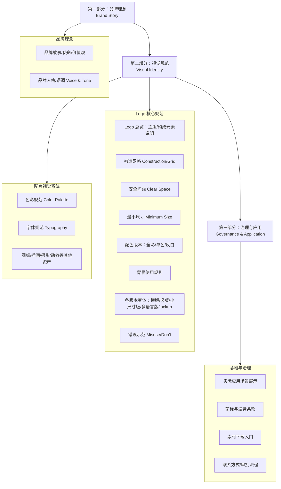

# Logo 设计规范参考文档（整合版）

> 本文档整合自 8 份调研笔记（类型分类、几何网格、安全间距与最小尺寸、色彩规范、字体规范、误用禁忌、交付物与格式、品牌手册文档结构），目的是为编写"指导 AI 设计 Logo"的 Claude Code Skill 提供事实依据。所有具体数值均标注来源背景；凡标注"经验法则"的数值均为业界惯例而非强制标准，供 Skill 设计时选择默认值参考。

---

## 一、类型选择（Logo Type Selection）

### 1.1 七种基础类型（业界最大公约数）

分类逻辑是一个光谱：**纯文字 → 文字+图形 → 纯图形**，外加"角色"这一独立维度。

| 类型 | 定义 | 适用判断 | 优点 | 缺点 | 例子 |
|---|---|---|---|---|---|
| **Wordmark / Logotype**（文字标） | 不含图形符号，仅用定制字体呈现全名 | 名称短、独特、易读易发音 | 认知路径最短；跨媒介一致性强 | 名称过长/生僻则效果差；用非定制字体辨识度低 | Google、Coca-Cola、Visa、FedEx |
| **Lettermark / Monogram**（字母标） | 用首字母/缩写构成，是 Wordmark 的压缩形式 | 全名过长拗口，或缩写已有文化认知 | 高清晰度、极易缩放 | 字母本身无内在含义，新品牌用会显空洞；同行业缩写易撞车 | IBM、CNN、HP、HBO、NASA |
| **Pictorial Mark**（图形标/象形标） | 用一个具象、可识别的图像独立代表品牌 | 品牌已有认知度和持续曝光预算 | 一旦建立认知，识别速度比抽象标快约 30%；不受语言限制 | 对新品牌"零起点意义"，需长期曝光才能建立符号=品牌的认知 | Apple、Target、Instagram、WWF |
| **Abstract Mark**（抽象标） | 几何化/非具象的自创符号，含义完全后天赋予 | 业务跨多品类，需规避地域/文化联想 | 不受单一产品束缚，扩展性强 | 风险最高一类，形式"几乎任意"，完全依赖后天曝光建立意义 | Nike Swoosh、Pepsi、Chase、Airbnb Bélo |
| **Mascot Logo**（吉祥物标） | 拟人化/卡通角色作为品牌代言人 | 情感温度是购买决策关键因素的行业 | 情感连接力强，媒体预算有限品类回忆率高出约 22% | 不适合高端/专业 B2B；当前极简趋势下"不够时尚"；小尺寸细节易糊 | KFC 上校、米其林轮胎人、Duolingo 猫头鹰 |
| **Combination Mark**（组合标） | Wordmark/Lettermark + Pictorial/Abstract/Mascot 并排/堆叠/融合 | 几乎适用任何阶段，尤其新创品牌，风险最低 | 名称+符号双路径同步曝光；符号可在品牌成熟后独立使用 | 设计复杂度高，需同时平衡文字图形比例风格 | Adidas、Burger King、Adobe、Mastercard |
| **Emblem Logo**（徽章标） | 名称被完整包裹在符号/徽章/盾形之中，文字图形**不可分割** | 购买决策受传承感/机构信誉驱动的行业 | 传达传统、权威、机构分量感；不易被仿制 | 小尺寸下"响应式表现最差"；品牌延展灵活性最低 | Starbucks、Harley-Davidson、NFL、大学校徽 |

**关键统计**：Forbes 250 强企业 logo 中，组合标使用量约 152 家，遥遥领先第二名纯文字标（58 家），是"最主流"的类型。

### 1.2 Emblem 与 Combination Mark 的核心判定标准

**能否拆分独立使用**：Combination Mark 的文字和符号相互独立、可分开展示（如 Nike 文字与 Swoosh 可分离）；Emblem 中文字被"焊死"在符号内部，脱离整体会失去意义（如大学校徽）。这是二者唯一可靠的判定标准，其余描述性区分都存在灰色地带。

### 1.3 延伸设计技法（非独立品类，视为呈现形式）

不同来源对"类型总数"存在分歧（7 / 9 / 11 种），多出的部分本质是**设计技法/应用形式**，可与前 7 类自由组合，不应与核心 7 类混淆：

- **Dynamic Marks（动态标）**：外观随场景/媒介变化但保留核心识别元素（MTV、Google Doodle、FedEx 多色变体）
- **Negative Space Logos（负空间标）**：利用留白构成隐藏图形（FedEx 箭头、布朗克斯动物园）
- **3D Logos**：强调立体质感（PlayStation、Takis）
- **Letterform Logos（单字母图标标）**：与 Lettermark 区别是只用**一个**字母而非多个首字母（Pinterest 的 P、Netflix 的 N）
- **Animated Logo**：用于视频片头/广告的动效标

### 1.4 分歧点（需在 Skill 中明确提醒 AI）

1. **Emblem vs Combination Mark** 争议最大，是从业者常年争论的灰色地带
2. **Pictorial 与 Abstract 是否合并**：99designs 统称为"Logomark"大类，VistaPrint/Shopify 视为并列独立类型
3. **具体品牌归类不一致**：Adidas 三道杠有的归 Combination Mark 有的归 Abstract Mark；Amazon 有的归 Wordmark（箭头视为文字装饰）有的归 Combination Mark（箭头视为独立符号）——说明品牌归类带有主观判断空间
4. **纹章（Crest）vs 徽章（Emblem）**：Crest 特指基于盾形/纹章学传统的样式，识别门槛和小尺寸可读性问题比一般 Emblem 更突出，常被业界混用

### 1.5 行业选型参考表（启发式，非绝对规则）

| 行业领域 | 推荐类型 | 认知驱动因素 |
|---|---|---|
| 金融科技 | Wordmark + Abstract 符号组合 | 信任感与精准感 |
| 快消品/食品饮料 | Mascot 或 Pictorial | 情感温度 |
| B2B SaaS | 定制 Wordmark | 权威感与规模感 |
| 奢侈品/时尚 | Lettermark 或 Emblem | 传承感与稀缺性 |
| 专业服务 | Combination Mark | 可靠性 |

**选型三问**（比罗列类型更利于生成有依据的建议）：
1. **名称长度与独特性**——短名用 Wordmark，长名用 Lettermark/Combination
2. **品牌认知投入预算**——纯符号类需长期曝光投入，Combination Mark 风险最低最适合新品牌
3. **最小应用场景**——favicon/App 图标/社交头像等极小尺寸下的可读性，是淘汰 Emblem/Mascot 等复杂类型的常见原因

### ✅ 类型选择 — 可直接转化为设计规则的清单

- [ ] 优先从 7 种基础类型（Wordmark / Lettermark / Pictorial / Abstract / Mascot / Combination / Emblem）中选择，Dynamic/负空间/3D/单字母/动效作为可选叠加技法
- [ ] 判定 Combination 还是 Emblem：文字与符号能否被拆分独立使用（能→Combination，不能→Emblem）
- [ ] 新品牌 / 预算有限 / 认知度低 → 默认优先推荐 Combination Mark（风险最低）
- [ ] 推荐类型前先问三问：名称长度是否适合直接读出？是否有预算支持长期曝光建立符号认知？最小应用场景（favicon/App 图标）下是否仍可辨识？
- [ ] 复杂类型（Emblem、Mascot）在建议时需提示"需额外设计一套简化响应式版本"
- [ ] 输出品牌归类建议时应说明这是"参考性判断"而非绝对分类，避免武断

---

## 二、网格构造（Geometric Grid Construction）

### 2.1 网格系统的四种用途分层

| 类型 | 使用阶段 | 作用 |
|---|---|---|
| **基础网格 Base Grid** | 设计**之前** | 提供初始结构，子类型：方形网格、等轴测网格、六边形网格、黄金比例网格 |
| **构造网格 Construction Grid** | 设计**之后** | 对已完成 logo 做像素级精修，标注锚点、控制柄、轮廓；传统手工做法耗时 30–60 分钟/个 |
| **锁定网格 Lockup Grid** | 图形标志与文字组合时 | 确定 logomark 与 wordmark 间距和层级，常用**三等分法则** |
| **留白网格 Clearspace Grid** | logo 定稿**之后** | 定义四周"排斥区"，用字母 X 标注单位 |

品牌手册的三层文档结构惯例：①可编辑 logo 图稿层 ②锁定的构造层（圆形/锚点/辅助线）③锁定的基础几何网格层，通常并排或叠加展示。

### 2.2 四种几何网格的具体构造方法

**① 圆形网格（Circle Grid）**
- 选定基准圆直径为全局单位（矢量软件常用 100–1000 单位以保证精度，经验法则）
- 通过简单比例（1/2、1/3）或黄金比例（φ≈1.618）推导次级半径：基准半径 100 → 黄金比例次级半径≈61.8，对半比例次级半径=50
- **同心圆法**：圆心对齐，按比例画多个同心圆定义弧线、字腔、端点
- **相交圆法**：多个圆心放在彼此象限点上，制造切点/交点供布尔运算裁形
- 经验法则：大弧与小弧半径之比常设为 1:1.618

**② 黄金比例网格（Golden Ratio Grid）**
- φ≈1.618，基础是斐波那契数列
- 构造步骤：正方形→复制减半正方形→钢笔连线并旋转 **-63.5°**→构建黄金矩形逐级分割→在最大网格正方形内画圆并删除两个锚点得 1/4 弧→逐级复制旋转拼接成对数螺旋
- 应用手法：小弧半径 = 大弧半径 ÷ 1.618（经验法则）
- 教程原话强调："目标是平衡（balance），而不是机械式的完美（mechanical perfection）"

**③ 模块网格（Modular Grid / 方格网格）**
- 定义基准单位（笔画最细宽度=**1x**），其余笔画为整数倍（2x、4x），间距为分数倍（0.5x、1x）
- 常见起点：Illustrator 网格细分设为 **8×8**，根据复杂度再调整

**④ 三角形/正方形辅助线**
- NatWest 银行、三菱菱形 logo：仅用**一个等边三角形**即可高精度重建比例结构
- 麦当劳金拱门：用**四个椭圆**即可复原
- Google "G"、Apple、Nike 因运用格式塔视觉修正原理，**无法**用纯几何系统精确复现——提醒网格并非万能
- **视觉校正 vs 数学对齐经典案例**：三角形在正方形中居中若按数学中点对齐会显得"偏低"，需人工上移才顺眼

### 2.3 工具与操作细节

- Adobe Illustrator：`View > Show Grid`、`Snap to Grid`（Mac: Cmd+; / Cmd+'）；吸附容差 2 像素
- 专门工具：Akrivi Gridit（Illustrator 插件，一键生成三类网格）、KSDrafter、AnchorLabs（Figma 插件）
- 传统手工构造一套 construction grid 耗时 **30 分钟至 1 小时**/个

### 2.4 批判性视角（Skill 中必须提醒 AI 的边界）

- 黄金比例在 logo 设计中的"神圣地位"很大程度上是**都市传说**，缺乏科学/历史依据；对 Apple logo 的黄金比例分析被证明是"confirmation bias（自证偏差）"的经典案例
- **post-rationalization（事后包装）现象**：不少设计师先凭直觉完成设计，再倒推画一套黄金比例网格图，用来向客户证明"这是数学推导的"——这是话术包装，非真实设计方法论
- 反面案例：Twitter 老版小鸟"15 个圆按黄金比例叠加"从未被官方证实；Pepsi 2008 年重设计泄露的"Breathtaking"文档（引用黄金比例、蒙娜丽莎、地球磁场）被业内广泛嘲讽为"胡言乱语的大师课"

### 2.5 历史标杆案例

蒙特利尔 1976 年奥运会会徽标准手册包含完整构造网格：垂直参考线 V1、V2…、水平参考线 H1、H2…，明确说明"仅需两个半径 AB 和 AC 即可构造出会徽全部曲线并完成视觉校正"——用于跨地域一致复现的经典历史案例。

### ✅ 网格构造 — 可直接转化为设计规则的清单

- [ ] 按设计概念本身决定用哪种网格（圆形/黄金比例/模块/三角），没有一种网格适用于所有 logo
- [ ] 网格是**起草阶段的比例参考工具**，最终必须做"光学校正"（optical correction），不可机械服从网格
- [ ] 模块网格默认起点：基准笔画宽度 1x，衍生 2x/4x；间距 0.5x/1x；细分网格从 8×8 起
- [ ] 圆形/黄金比例网格中，大小圆半径关系可选用 1:1.618 或简单分数比例（1/2、1/3）作为经验起点
- [ ] 黄金比例只作为"辅助直觉、产生和谐比例感"的经验手法表达，禁止生成"1.618 是必然规律"式的伪科学包装说辞
- [ ] 若输出品牌手册风格文档，应包含独立的"logo construction"页展示网格线/坐标，与 clearspace 页相邻

---

## 三、安全间距与最小尺寸（Clear Space & Minimum Size）

### 3.1 Clear Space 通用定义模式

**核心原理**：用 logo 自身的某个几何特征作为度量单位「X」，规定四周最小留白为 X 的某个倍数（通常 0.25X–1.5X），而不是用固定像素/毫米——因为固定值无法随 logo 缩放。

常见 X 单位选取方式（按出现频率）：

| 选取方式 | 案例 |
|---|---|
| Logo/图形符号整体高度 | Netflix Wordmark 用字母"T"宽度；IBM 用 logo 自身高度 |
| 某个大写字母字高（cap height） | Johns Hopkins 用"H"；U. Memphis 用"T"；Uber 用"U" |
| 图形符号高度/宽度的一部分（0.25X/0.5X） | Netflix Symbol：留白=N 宽度×0.5；Spotify：推荐 50%，最小 25% |
| 重复图形单元尺寸 | Slack 横版：留白≥"#"符号整体大小；竖版：留白≥一个菱形色块长度 |
| 整体宽度百分比 | Twitter/X：留白≥logo 宽度 150% |

**具体案例数值表**：

| 品牌 | Clear Space 规则 |
|---|---|
| SolidRun | 顶部/侧边=0.4X，底部=0.5X（底部略大补偿视觉重心） |
| Johns Hopkins Medicine | 四周最小留白="Hopkins"中大写 H 的高度 |
| Netflix | Symbol：N 宽度×0.5；Wordmark：字母"T"的宽度 |
| Spotify | Exclusion zone=icon 高度 50%（旧版：推荐 50%，最小 25%） |
| Slack | 横版≥#符号整体尺寸；竖版≥一个菱形单元长度 |
| Uber | ="U"字母的 cap height |
| WWF | ="W"字母高/宽 |
| FedEx | ≥wordmark 的 x-height（保护 E-x 之间隐藏箭头负空间） |
| Vevo | Web/平板端上下最小留白固定 20px |
| Twitter/X | ≥logo 宽度 150% |

### 3.2 Minimum Size 数值案例

**度量单位惯例**：印刷用 mm/inch，数字用 px；常分"整体 logo"与"仅图标"两档。

| 品牌/机构 | 印刷最小尺寸 | 数字最小尺寸 |
|---|---|---|
| Spotify | 整体≥20mm；仅 icon≥6mm | 整体≥70px；仅 icon≥21px |
| Johns Hopkins Medicine | 横版≥1.5 英寸；竖版≥1.25 英寸 | 未给出（低于阈值改用文字排版） |
| University of Memphis | ≥1.25 英寸（沿长边） | — |
| 小米 IoT 认证商标 | 40mm | 150px |
| Slack | — | 常规横版最小 50–90px 宽；小尺寸专供符号 15–20px 高 |
| Twitter/X | — | 主体≥16px 宽；社交图标≥32px 宽 |
| Netflix（API 场景） | — | 主 API logo≥100px；次要≥16px |

### 3.3 数字端技术尺寸档位（图标化延伸场景）

**App 图标（Apple HIG）**：App Store 提交 1024×1024pt；iPhone 主屏 60×60pt(@3x=180px)；iPad 76×76pt(@2x=152px)；iPad Pro 83.5×83.5pt(@2x=167px)；Spotlight 40×40pt(@3x=120px)；设置页 29×29pt(@3x=87px)；经验法则：图标在"实际显示尺寸一半"仍应可辨识

**Favicon**：16×16px（标签页基线）、**32×32px**（若只做一个尺寸就做这个）、48×48px（任务栏）、180×180px（Apple Touch Icon）、192×192px/512×512px（Android/PWA）

**Material Design 产品图标**：标准 48dp，边缘线宽 1dp，编辑时放大到 400%（192×192dp 画布）绘制

### 3.4 原理归纳

1. **可读性**：clear space 防止文字/图片贴近误认；minimum size 防止细节糊在一起、负空间消失（如 FedEx 箭头）
2. **视觉呼吸感**：让 logo 在版面中"跳出来"，几乎所有手册都用"give it room to breathe"表述
3. **跨媒介一致性**：用比例单位（X）而非固定像素定义 clear space 是所有案例中最一致的技术判断
4. **低于阈值时的应对**：不建议无限缩小主 logo，而应**切换到预先设计好的简化版本**（Johns Hopkins 改用文字排版；Slack 用专供小尺寸的简化符号）

### ✅ 安全间距与最小尺寸 — 可直接转化为设计规则的清单

- [ ] Clear Space 用参数化描述："以 X（logo 高度/图形符号宽度/某关键字母字高）为单位，四周至少预留 0.25X–1X"，默认可取 **0.5X** 作为通用起点
- [ ] 印刷最小尺寸默认值：整体 logo ≥ 20–25mm，仅图标 ≥ 6–10mm
- [ ] 数字最小尺寸默认值：整体 logo ≥ 60–80px，仅图标/favicon ≥ 16–32px
- [ ] 必须输出"低于最小尺寸时的替代方案"（简化图标版/纯文字版），而非允许无限缩小主版本
- [ ] App 图标固定按 1024×1024（iOS）/108dp 画布+66dp 安全区（Android）标准生成，不与品牌 clear space 规则混用
- [ ] Favicon 最低要求 16×16px，推荐同时产出 32×32px 作为"只做一个尺寸"的默认选择

---

## 四、色彩规范（Color Specification）

### 4.1 色彩三层体系

| 层级 | 定位 | 使用范围 |
|---|---|---|
| **主色 Primary** | 品牌识别度核心，通常 1–2 个 | 优先用于 logo 本体、核心视觉 |
| **辅助色 Secondary** | 补充灵活性 | 图形元素、界面强调、辅助信息层级 |
| **第三级/强调色 Tertiary/Accent** | 严格受限 | 仅限图形装饰/点缀，**禁止用于文字**，禁止升级为任何子品牌主色 |

案例：USC 的 Cardinal（深红）与 Gold 是两个地位对等主色，另设黑/白/两级灰(30K/70K)+Rich Black；Northwestern Engineering 核心紫色生成 **10 级明度色阶**（Purple 10→160），灰阶做 10%–100% 共 10 级划分。

### 4.2 色彩模式标注惯例

| 色彩模式 | 适用场景 | 说明 |
|---|---|---|
| **Pantone(PMS)** | 商业印刷（名片、周边、丝网印刷） | 预调专色油墨，一致性最高，不受纸张/设备影响；需区分 **Coated(C)/Uncoated(U)** |
| **CMYK** | 全彩印刷（画册、海报、包装） | 四色网点叠加，成本低但受纸张/设备影响产生偏差 |
| **RGB** | 仅屏幕显示（PPT、视频） | 色域更广更鲜艳，直接印刷会失真 |
| **Hex** | Web/App 开发（CSS） | 本质是 RGB 的十六进制表示 |

**规则**：一份完整品牌色卡条目应同时列出 `Pantone(C/U) + CMYK + RGB + Hex` 四组数值，缺一不可。

### 4.3 明背景/暗背景适配版本

通用分级模式：

| 背景明度区间 | 允许的 logo 版本 |
|---|---|
| 浅色（约 0–20% 深度） | 全彩版、品牌色版、或纯黑版 |
| 中间调（约 30–50%） | 只能用纯黑版 |
| 深色（约 60–100%） | 必须用反白（白色）版 |

- Spotify：绿色 logo 只能出现在纯黑/纯白背景，浅背景用黑版，深背景用白版
- Slack：全彩 logo 只能出现在白色、黑色、或品牌专属"aubergine"（茄紫）背景——限定白名单背景而非任意背景
- 每个背景版本应**单独设计与测试**，反白版有时需微调笔画粗细以保证视觉重量一致

### 4.4 单色版/纯黑/纯白反白版制作规范

**正确流程**（非简单去饱和度）：①移除颜色填充替换为纯色 ②去除所有渐变替换为扁平纯色 ③检查描边粗细/间距是否需微调 ④多尺寸测试确认不糊字不并线

**分级复现方式（Reproduction Methods）**：全彩版（默认）→ 双色版 → 单色版（丝网印刷/小尺寸/成本受限）→ 黑白/灰阶版（传真/报纸）。**核心原则：logo 必须先在纯黑白下依然成立，彩色只是加分项**。

**最低限度交付文件组合**：全彩 SVG、纯黑 SVG、纯白 SVG、透明底 PNG。

### 4.5 色彩使用禁忌清单

1. **禁止随意更改品牌色数值**——不可凭感觉微调色相/饱和度/明度；不允许引入调色板之外的新颜色
2. **禁止施加未经授权的渐变、阴影、描边、发光等特效**
3. **禁止 logo 与背景撞色/融为一体**（全黑背景配黑 logo 等）
4. **禁止使用不满足无障碍对比度标准的配色组合**
5. **禁止拉伸/挤压/倾斜/旋转/镜像，禁止单独缩放内部元素**
6. **强调色禁止用于文字，禁止被子品牌升级为主色**
7. **印刷端避免过饱和色彩导致 CMYK 失真**
8. **Pantone 专色文件需单独获取授权色库**（Adobe 应用已不再内置提供）

### 4.6 WCAG 对比度相关

- **WCAG 官方立场**：logo 中的文字（logotype）**明确豁免**于 1.4.3 对比度要求
- **业界建议**："能做到就应该做到"——设计有弹性时仍应尽量满足，因为不可读性问题会外溢到 WCAG 管不到的线下场景
- **可参考的通用数值基准**：AA 级 1.4.3 正常文字 ≥ **4.5:1**，大号文字(≥18pt 或 14pt 加粗) ≥ **3:1**；AAA 级 1.4.6 正常文字 ≥ **7:1**，大号 ≥ **4.5:1**；AA 级 1.4.11（非文字对比度，更贴近 logo 场景）图形对象/UI 组件 ≥ **3:1**
- 部分品牌方（如 USC）直接把"ADA 无障碍对比度标准"内化为品牌硬性禁令，即使 W3C 本身未强制要求 logo

### ✅ 色彩规范 — 可直接转化为设计规则的清单

- [ ] 每个品牌色同时标定 **Pantone(C/U) + CMYK + RGB + Hex** 四组数值并注明各自适用媒介
- [ ] 至少准备**全彩版、纯黑版、纯白反白版**（外加可选灰阶版/单色版），并明确各版本对应的背景明度区间或指定背景色白名单
- [ ] 单色化需重新设计填充逻辑（纯色替代渐变、微调笔画），并在多尺寸下验证可读性
- [ ] 色彩红线清单：不改动品牌色数值 / 不加特效 / 不与背景撞色 / 不用未达标对比度组合 / 强调色不升格为主色不用于文字
- [ ] Logo 主色与允许背景色的对比度实测，作为"是否需要切换黑白反白版"的量化判断依据（图形组件基准 3:1，正文文字基准 4.5:1）
- [ ] Logo 必须先验证在纯黑白模式下依然成立可辨识，再考虑彩色版

---

## 五、字体规范（Typography）

### 5.1 定制字体 vs 现成商业字体

**定制的优势**：原创性差异化、法律可防御性（更易获商标注册）、长寿命（不易过时）、品牌调性精细控制。

**现成字体更合理的场景**：预算有限（初创）；符号才是认知主力、文字只是辅助；短期/实验性项目。

**投资定制的判断标准**：高端/传承型品牌、字体即核心资产（纯文字/字母标）、需跨极端多样媒介适配、竞品视觉高度雷同、品牌重塑节点。

**折中方案**："改到不可识别原字体"——即使不完全定制，也应对现成字体做充分修改（字重曲线、连字、独有笔画细节），业内共识：**未经修改直接套用现成字体的 wordmark 既难获辨识度，也难通过商标显著性审查**。

### 5.2 字重（Font Weight）

- **小尺寸场景优先粗字重**：32×32px 下笔画细于 2px 会糊成一团
- **测试基准**：至少 4 个尺寸验证——8pt（移动 favicon）、16pt（移动正文）、36pt（桌面页头）、72pt+（户外标牌）
- **字重与图形符号呼应**：组合标中文字笔画粗细应与符号线条粗细视觉匹配
- **logo 字体 vs 品牌字体系统**：logo 本身字重可为定制极端值以求独特，但用于正文/界面的"品牌字体"须回归功能优先，需完整字重梯度（Light/Regular/Medium/Bold）

### 5.3 字距（Kerning / Tracking）

- **Kerning**：针对特定字母对（A-V、T-o、W-A）局部微调，纠正视觉忽宽忽窄
- **Tracking**：对整个单词做统一整体缩放，调节视觉密度和品牌调性（紧密=现代/科技；宽松=优雅/高端）
- **原则**：永远不信任软件默认字距；该用哪种取决于问题范围（局部→kerning，整体→tracking）；须在最终展示尺寸下检验
- **交付规范建议**：品牌指南应明确写出 wordmark 的字距数值（Illustrator tracking 值或 em 值），防止后续应用方随意调整

### 5.4 安全区域（同 clear space 逻辑，文字场景补充）

- 参考单位选取：单个字母高度（Google 用 G、PayPal 用 P）、x-height、整体文字高度（Netflix、Samsung）、图形符号尺寸（Microsoft、Slack）
- 不同应用媒介经验值：印刷品约 **0.5 英寸**；户外海报/广告牌边距 **10–15%**；网页/移动端 **20–50px**；刺绣/织物 **logo 高度 1.5 倍**（工艺精度限制）；T 恤印刷 **logo 宽度 20%**；社交媒体 **≥15%**
- 数字端最小可用尺寸：主 logo ≥ 80px 宽，纯图标 ≥ 24px 高；App 图标需在 16×16px 依然可辨（此时通常降级为纯 icon）

### 5.5 多语言/多字重版本

**多语言处理**：
- 不同文字系统结构差异：拉丁字母灵活度高作基准脚本；阿拉伯文连笔/位置变形/RTL 需避免过度几何化；CJK 方形笔画密集字符集庞大，同字号视觉更"重"需专门做字重平衡；梵文类有水平顶线（shirorekha），**直接音译拉丁品牌名通常失败**，需重新设计而非"翻译换皮"
- 三种一致性策略：①统一泛 Unicode 多文种字体家族（Google Noto、思源）②每文字系统单独定制但风格特征对齐 ③选择音译/意译之一并全球统一执行不混用
- 案例：Samsung 定制 SamsungOne 覆盖 **26 种书写系统、400+ 语言**；Huawei 开发跨 Latin/Cyrillic/Greek/CJK 自定义字体家族；Starbucks 采取"符号不变、文字本地化"策略

**多字重/响应式字体系统**：
- **可变字体（Variable Font）**：单文件内含多字重/字宽维度插值，天然适配响应式场景（Burger King、Audi、Adidas 采用）
- **IBM Plex** 案例：**4 个字族 × 8 个字重（Thin–Bold）× 罗马体/斜体**，扩展支持 Arabic/Cyrillic/Devanagari/Greek/Hebrew/Japanese/Korean/Thai
- 落地建议：至少准备 **3 档字重资产**（Regular/Medium/Bold）应对深浅背景、印刷/屏幕的视觉重量补偿（深底浅字通常需比浅底深字略细，因光晕效应）

### 5.6 字体授权（Font Licensing）

- **核心法律区分**：字体设计（Typeface Design）本身多数法域下**不受版权保护**，受保护的是字体软件（Font Software）——可自由"模仿"外观，只要不使用其字体软件文件本身
- **EULA 审查三要点**：①是否明确允许静态图片/Logo 用途 ②是否明确禁止用于商标/logo ③授权是否可转让给客户（大多数商业字体许可**不可转让**）
- **规避风险的行业惯例——"转曲（Outline）"交付**：完成 wordmark 后将文字轮廓转为矢量路径，只交付矢量图形而非字体文件，客户拿到的 logo 不依赖字体授权即可永久使用
- **经典判例**：Shake Shack 诉讼——只要没有真正"使用"字体软件本身（而是重新绘制外观），就不构成 EULA 违约
- **例外**：网站/App 界面等**活文本（live text）**场景无法通过转曲规避，需单独购买 Web/App 授权（这是很多品牌"logo 用高端字体、正文用免费字体"的现实原因）

### ✅ 字体规范 — 可直接转化为设计规则的清单

- [ ] 若建议使用现成字体做 wordmark，必须提示做"足够程度形态修改"，不可原样照搬
- [ ] 小尺寸场景（favicon/App 图标）优先推荐粗字重，字重需在 8pt/16pt/36pt/72pt+ 四档验证
- [ ] Tracking/Kerning 数值需在交付说明中写明具体数值，不依赖软件默认值
- [ ] 组合标中文字笔画粗细需与图形符号线条粗细做视觉匹配
- [ ] 涉及多语言场景时不可直接音译拉丁字形，需按目标文字系统重新设计并保持调性对齐
- [ ] 交付说明中必须提示字体授权问题：确认许可证覆盖 logo/商标用途；定稿阶段建议转曲交付；若涉及网站活文本需单独确认 Web/App 授权或改用免费开源字体

---

## 六、误用禁忌清单（Misuse / Don'ts）

### 6.1 页面通用结构惯例

几乎所有专业品牌手册（Google、Slack、Spotify、GitHub、Netflix、Dropbox、MIT 等）都会紧跟在"Clear Space"和"最小尺寸"之后单独辟一页，标题多为 `Logo Misuse` / `Incorrect Usage` / `Don'ts`。呈现方式高度统一：**左侧"正确用法"1 张图 + 右侧一组"错误用法"缩略图**，每条错误配一句极简祈使句（"Don't rotate the logo."）。这种"图+一句话"的极简表达方式本身值得在 Skill 中模仿。

### 6.2 十四类禁止行为（综合多品牌交叉验证）

| # | 类别 | 典型表述示例 |
|---|---|---|
| 1 | 禁止拉伸/压缩变形 | Spotify: "Never stretch, squeeze, or distort"；GitHub: "Don't compress, distort, skew, stretch" |
| 2 | 禁止旋转/倾斜 | Spotify: "Don't rotate the logo."；Slack: "Rotating any part of the logo." |
| 3 | 禁止改变组合元素相对比例/排列 | Slack: "Changing the size or orientation of the octothorpe and logotype in relation to each other."；MIT: "Don't rearrange components of the lock-ups." |
| 4 | 禁止添加阴影/描边/渐变/3D/特效 | GitHub: "Don't add graphic effects like shadows or gradients."；Slack: "Using drop shadows or other effects." |
| 5 | 禁止改变官方配色/单色误用 | Spotify: "Never change its colors."；MIT: "Don't apply two or more colors to the logo." |
| 6 | 禁止低对比度/杂乱背景上使用 | GitHub: "Don't place the logo over busy backgrounds."；Google: "Don't place the Google G on backgrounds that inhibit legibility." |
| 7 | 禁止拥挤放置（违反 clear space） | Uber: "The amount of clear space around the logo should be equal to or greater than the height of the 'U'."；Netflix: "The logo needs enough space around it so it does not compete with other text, images..." |
| 8 | 禁止拆解/重排内部构成元素 | GitHub: "Don't rearrange the elements of the logo."；Dropbox: "…deconstructed…reconfigured…" |
| 9 | 禁止用吉祥物/插画/旧版本替代 logo | GitHub: "Don't use our illustration, mascots or Mona as a substitute for the logo."；Google: "Don't use older versions of the Google G." |
| 10 | 禁止嵌入句子当文字用/拼新图形 | Spotify: "Don't use the logo in a sentence or as a letter."；MIT: "Don't use the MIT logo as a replacement for MIT in text." |
| 11 | 禁止暗示官方背书/合作关系 | Google: "Don't imply endorsement."；Mailchimp: "Don't display these graphics in a way that implies a relationship, affiliation, or endorsement..." |
| 12 | 禁止与其他品牌 logo 强行组合/co-branding | Spotify: "Don't use the Spotify brand together with any other brand..."；MIT: "Don't combine the MIT logo with a department name to create a new identity." |
| 13 | 禁止挪用为自己产品/公司 logo 或未授权商品化 | GitHub: "Do not use any GitHub logo as the icon or logo for your business/organization."；Discord: "Use the Discord Marks or Brand Assets on merchandise." |
| 14 | 禁止未经许可的动画处理 | Google: "You also cannot animate a Google logo without explicit written permission."；Slack: "Adding special effects including animation." |

### 6.3 各品牌 Don'ts 页覆盖面对比（可作范本参考）

- **MIT** 和 **GitHub** 官方页面条目最完整、表述最规范，建议作为 Skill 撰写 checklist 时的主要参照模板
- **Slack** 和 **Spotify** 因"一句话+图示"的极简表达风格，适合作为措辞模板参考
- **Netflix** 额外增加了"Considerations"一节，覆盖物理载体使用禁忌（如不可印在门垫/飞镖靶/食品上），提示 Skill 也应考虑"实际应用边界"这一细分主题

### ✅ 误用禁忌 — 可直接转化为设计规则的清单

- [ ] 禁止拉伸/压缩——必须等比缩放
- [ ] 禁止旋转/倾斜
- [ ] 禁止改变组合元素间相对比例、位置或排列顺序
- [ ] 禁止添加阴影、描边、渐变、3D、发光、透明度等特效
- [ ] 禁止改变官方配色或对图标各部分做非官方配色/渐变填色
- [ ] 禁止在低对比度或视觉杂乱的背景上使用
- [ ] 禁止破坏安全距离，与其他图形/文字拥挤放置
- [ ] 禁止拆解、重组或重新排列 logo 内部构成元素
- [ ] 禁止用吉祥物、插画或旧版本 logo 代替官方版本
- [ ] 禁止把 logo 嵌入句子当文字使用，或拿元素拼新图形
- [ ] 禁止以任何方式暗示官方背书/合作/从属关系
- [ ] 禁止与其他品牌 logo 强行组合做 co-branding
- [ ] 禁止把 logo 挪用为其他产品/公司 logo 或用于未授权商品化
- [ ] 禁止未经许可对 logo 做动画处理

（以上 14 条建议 Skill 交付"设计规格说明"时以"图+一句话"的固定格式逐条列出，作为 Misuse 章节的默认模板。）

---

## 七、交付物与格式规范（Deliverables & File Formats）

### 7.1 矢量格式（母版文件）

| 格式 | 定位 | 典型用途 |
|---|---|---|
| **AI** | 最佳可编辑主文件 | 设计师内部存档、二次编辑 |
| **EPS** | 传统印刷矢量标准 | 印刷厂、标牌制作商、促销品定制商指定要求 |
| **PDF**（矢量非扁平化） | 通用矢量交换格式 | 印刷、大幅面输出、跨软件通用 |
| **SVG** | 网页专用矢量 | 网站/Web App/UI/响应式（可配合 CSS media query 条件显隐） |

**场景速查**：网站/社媒/邮件签名→PNG 或 SVG；快速分享→PNG 或 JPG；印刷厂/标牌→EPS 或矢量 PDF；二次编辑存档→AI。

### 7.2 位图导出规范

- **PNG**：需要透明背景的首选（logo/图标）；**JPG**：不需要透明度且要控制体积的场景

| 用途 | 建议规格 |
|---|---|
| 纯屏幕显示 | 72 DPI 起（现代做法倾向直接按目标像素尺寸导出） |
| Retina/高分屏 | 150 DPI，或按 @2x/@3x 像素倍数导出 |
| 印刷物料 | **300 DPI**（行业最低标准，72 DPI 用于印刷会明显模糊） |
| 常见通用导出尺寸 | 1920×1080（1080p）常规；4K 场景 3840×2160 |

### 7.3 平台图标尺寸标准

**Favicon**：16×16（浏览器标签最低要求）/ 32×32（"只做一个尺寸就做这个"）/ 48×48（任务栏）/ 180×180（Apple Touch Icon）/ 192×192 与 512×512（Android/PWA manifest 必需）。标准套件命名：`favicon.ico`(内含16/32/48) + `favicon-16x16.png` + `favicon-32x32.png` + `apple-touch-icon.png`(180×180) + `android-chrome-192x192.png` + `android-chrome-512x512.png`。**所有 favicon 必须为正方形**。

**iOS App Icon**：唯一提交文件 **1024×1024px**，PNG，**不允许透明通道**。运行时尺寸系统自动派生（主屏@2x/@3x 120/180px；iPad Pro 167px；iPad 152px；Spotlight 80/120px；设置 58/87px）。

**Android 自适应图标（Adaptive Icon）**：整体画布 **108×108dp**；安全区域 **66×66dp**（居中，任何 mask 形状都不裁切）；系统 mask 实际显示区 **72×72dp**；外圈预留 18dp（供视差/涟漪动效）。对应密度：ldpi 81px / mdpi 108px / hdpi 162px / xhdpi 216px / xxhdpi 324px / xxxhdpi 432px。Google Play 商店图标 **512×512px**。

**其他平台**：macOS App 图标 1024/512/256/128/64/32/16px 逐级集；PWA Manifest 推荐 48/72/96/144/152/192/384/512px；Windows 磁贴 70×70/150×150/310×150/310×310。

**社交媒体头像/封面**（2026 常见值）：Instagram 头像上传 320×320；Facebook 头像 196×196(桌面)/128×128(移动)，封面 851×315；LinkedIn 个人头像 400×400/封面 1584×396，公司主页头像约 300×300/封面 1128×191；X(Twitter) 头像 400×400/封面约 1500×500；YouTube 频道头像 800×800/封面 2560×1440。通用经验：头像建议 **400×400px 起**上传，Feed 图建议宽度 **1080px**，社交场景一律建议提供**正方形(1:1)版本**。

### 7.4 响应式 Logo 系统（分级模型）

行业共识是把 Logo 做成"按展示尺寸/空间分级的一套系统"，核心逻辑：**尺寸越小，视觉信息越要做减法**（渐进式简化 + 光学缩放）。

| 层级 | 触发场景 | 内容 |
|---|---|---|
| **完整 Lockup 版** | 大尺寸：官网首屏、名片、海报 | 图形标+完整品牌名(含 slogan 可选) |
| **主标版**（去 slogan） | 中等空间：文章配图、常规 Header | 图形标+品牌名 |
| **简化图标版** | 空间受限：App 图标、社交头像、水印 | 仅图形标记，需"仅剩图标用户也能识别品牌" |
| **极简单色 Favicon 版** | 极小：16×16～32×32 标签页 | 图标进一步简化+加粗描边+高对比度 |

**真实案例参考**（Sprout Social 品牌系统数字端最小尺寸）：横向 Lockup 最小 **144px 宽**；纯文字 Wordmark 最小 **104px 宽**；独立 Icon 最小 **40px 宽**；使用优先级：默认完整 Lockup → 对比度不足换纯 Wordmark → 仅在品牌已被认知且空间极受限时才用纯 Icon。

**技术实现**：SVG 是响应式 Logo 系统的最佳载体，单文件可通过 CSS media query 按断点切换不同复杂度子版本。**简化判断标准**："去掉文字后，用户仅凭图标是否还能认出这是哪个品牌"——不能则说明图标识别度不够需重新设计。

### 7.5 专业 Logo 交付包清单（汇总）

**矢量母版**（每变体×每配色版本各一份）：.AI / .EPS / .PDF / .SVG

**位图导出**：PNG（透明背景，多规格如 500/1000/2000px 宽）、JPG（白底/纯色底）

**Logo 变体**：横版/竖版（堆叠版）；完整 Lockup/简化 Icon/纯文字 Wordmark；全彩/黑白反白/纯黑/纯白/单色线稿（水印用）

**平台专用图标集**：Favicon 套件(16/32/48/180/192/512)；iOS App 图标(1024主图不透明)；Android 自适应图标(前景+背景+单色层，108dp/66dp)；社交头像方形版(建议400×400起)

**配套规范说明**：Clear Space 规则、最小使用尺寸(印刷/数字分别注明)、色彩值(HEX/RGB + CMYK/Pantone)、各版本适用场景与使用优先级

### ✅ 交付物与格式 — 可直接转化为设计规则的清单

- [ ] 矢量母版最低要求：AI（可编辑源文件）+ SVG（网页用）+ 矢量 PDF（印刷/跨软件通用），EPS 按客户/供应链需求可选提供
- [ ] 位图导出：透明 PNG 为默认首选，印刷场景一律 300 DPI，屏幕场景按目标像素直接导出
- [ ] Favicon 套件固定输出 16/32/48/180/192/512 六档，全部为正方形
- [ ] iOS 主图标固定 1024×1024 不透明 PNG；Android 自适应图标固定 108dp 画布+66dp 安全区+72dp mask
- [ ] 输出至少 4 级响应式分级资产：完整 Lockup / 主标版(去slogan) / 简化图标版 / 极简 Favicon 版，并标注各级触发的最小像素宽度
- [ ] 简化图标版验收标准：去掉文字后用户仍能凭图标认出品牌，否则打回重新设计
- [ ] 交付包必须包含全彩/纯黑/纯白反白三个色彩版本 × 横版/竖版两个方向的完整矩阵

---

## 八、品牌手册文档结构范例

### 8.1 通用三段式骨架

综合 Slack、GitHub、Netflix、Google、Spotify、Mailchimp、Airbnb、Uber、IBM 九个真实案例，归纳出的通用骨架：

**线性列表版（可直接映射为 Skill 输出模板的 11 节结构）**：

1. **开篇/品牌理念**——使命、价值观、人格化描述
2. **Logo 总览**——展示主 logo、图形符号+文字标的组成关系
3. **构造网格/比例关系**——最"硬核"但非所有品牌都公开的一节
4. **安全间距 Clear Space**——几乎所有案例都有
5. **最小尺寸 Minimum Size**——几乎所有案例都有，分印刷/数字两套数值
6. **色彩规范**——主色+辅助色+背景适配+无障碍配色
7. **字体规范**——品牌专属字体+备用系统字体
8. **各版本变体**——横版/竖版/单色版/小尺寸版/多语言版/联合 lockup
9. **错误示范 Misuse/Don't**——几乎 100% 案例都有，配图，条数集中在 6–12 条
10. **实际应用场景展示**——网站/社媒/周边/包装/视频水印等真实载体，常伴随特殊场景例外规则
11. **治理与法务/联系方式**——商标声明、使用授权范围、素材下载入口、审批联系方式，通常放全文末尾

### 8.2 跨案例章节顺序对照（节选关键行）

| 主题 | Slack | GitHub | Netflix | Google(SoD) | Spotify | IBM |
|---|---|---|---|---|---|---|
| 构造网格 | Octothorpe 19×19 网格 | — | — | — | — | 2 的倍数网格 |
| 安全间距 | 隐含于误用规则 | Invertocat 页内 | Clearing space | Spacing | Clear space | Clear space |
| 最小尺寸 | 小尺寸专用版 50-90px | — | — | 130px/80px | 印刷30mm/数字130px | 16pt |
| 错误示范 | Logo misuse | Usage(禁止事项) | Avoid | Unacceptable usage | Misuse | — |

### 8.3 三个可复用的结构洞察

1. **"以字母自身尺寸做间距/最小尺寸单位"是跨品牌高频套路**（IBM 用"I"、Netflix 用"T"/N宽度一半、Google 用"S"、Slack 用 octothorpe 自身、Spotify 用 logo 高度 1/5）——可复用为 Skill 的"通用公式"
2. **错误示范章节几乎是标配且高度模式化**：旋转、拉伸/变形、改色、加特效、杂乱背景、装进容器/边框、侵占安全间距、替换字体——这 8 类几乎覆盖所有案例的 misuse 列表（对应第六章的 14 类）
3. **现代品牌手册正从"单一 PDF"转向"可交互网站"**（GitHub、Uber 都是 Frontify/自建站点），网站型手册顶层导航常为"理念→基础规范(含Logo)→图形元素→应用场景→动态识别"，比传统 PDF 多了"Motion identity/动效"一层

### ✅ 品牌手册文档结构 — 可直接转化为设计规则的清单

- [ ] 输出品牌/Logo 使用手册时按"品牌理念→视觉规范(Logo核心+配套系统)→治理与应用"三段式组织
- [ ] Logo 核心规范固定包含：总览→(可选)构造网格→安全间距→最小尺寸→配色版本→背景规则→版本变体→错误示范，八项按此顺序排列
- [ ] 错误示范章节固定采用"左正确用法图+右错误用法缩略图组+一句话说明"的极简呈现格式
- [ ] 手册结尾固定包含商标声明/使用授权范围/素材下载入口/联系方式四项收尾内容
- [ ] 若面向不同受众（如硬件合作方、内容集成方），可参考 Spotify/Netflix 做法拆分成多份短文档而非强行塞入一份大手册

---

## 九、给 Skill 设计者的建议

### 9.1 适合写成硬性规则（Hard Rule）的规范

这些条目在多个独立来源中高度一致、可客观判定、且违反后果明确（法律风险、可读性失效、品牌资产贬值），建议在 Skill 中作为**强制校验项**：

- **矢量母版交付**：必须提供 SVG/EPS/PDF/AI 至少一种矢量格式作为母版，不可仅交付位图
- **至少三个色彩版本**：全彩版 + 纯黑版 + 纯白反白版，logo 必须先在纯黑白模式下依然成立可辨识
- **Clear Space 必须用相对单位（X 单位）表达，不用固定像素/毫米**——这是所有案例中最一致的技术判断
- **每个品牌色必须同时标定 Pantone(C/U) + CMYK + RGB + Hex 四组数值**
- **14 类误用禁忌**（禁止拉伸变形/旋转/改比例/加特效/改色/低对比度背景/侵占间距/拆解重组/替代吉祥物/嵌入文字/暗示背书/强行co-branding/挪用商品化/未授权动画）——这些在 Google、Slack、GitHub、Spotify、MIT 等几乎所有一手品牌手册中重复出现，属于行业共识级别的硬性红线
- **必须分别给出印刷最小尺寸(mm/inch)和数字最小尺寸(px)，且区分"整体logo"与"仅图标"两档**
- **App 图标/Favicon 必须遵循平台强制技术规格**（iOS 1024×1024不透明、Android 108dp/66dp、favicon 正方形），这些是平台硬约束而非设计惯例
- **低于最小尺寸时必须切换到预先设计的简化版本，而非无限缩小主版本**
- **字体授权检查**：若使用现成字体，必须在交付说明中提示 EULA 授权范围，并建议转曲交付

### 9.2 适合写成经验性建议（Guideline）的规范

这些条目在不同来源间数值差异较大（相差 2–6 倍），或本质上是审美/工作流偏好而非客观标准，建议在 Skill 中作为**可调整的默认值/启发式建议**，并向用户明确标注"这是行业常见做法之一，非唯一标准"：

- **黄金比例(φ≈1.618)网格构造**——多个信源明确指出其"神圣地位"很大程度是都市传说和 post-rationalization（事后包装），可作为一种"产生和谐比例感的辅助直觉"呈现，但不应被表述为设计的必要条件
- **Clear Space 的具体 X 倍数**——不同品牌从 0.25X 到 1.5X 不等，无统一标准，建议默认给出 0.5X 起点但允许调整
- **最小尺寸的具体数值**——Spotify(20mm/70px) vs 小米(40mm/150px) vs Johns Hopkins(1.5英寸) 差异显著，只能给"合理默认值区间"而非唯一正确答案
- **7 vs 9 vs 11 种 logo 类型的分类总数**——建议以 7 类为核心框架，Dynamic/负空间/3D/单字母/动效作为"延伸技法"单独说明，避免与核心类型混淆
- **行业→类型映射表**（金融科技用Wordmark+Abstract等）——仅为启发式参考，不应作为强制推荐逻辑
- **网格系统选型**（圆形/黄金比例/模块/三角）——设计工具而非必须遵守的公式，应服务于"最终光学校正"这一更高优先级原则
- **定制字体 vs 现成字体的取舍**——高度依赖预算和项目阶段，无普适答案，应作为决策树式建议而非固定规则

### 9.3 调研中发现的主要分歧点（Skill 需明确提示 AI 保持谨慎的地方）

1. **黄金比例的合法性争议**——被多个权威信源（Fast Company、goldennumber.net）证明存在大量"事后包装"案例（Twitter 老版小鸟、Pepsi "Breathtaking" 文档），Skill 应避免让 AI 生成伪科学式的比例合理性说辞
2. **Emblem vs Combination Mark 边界模糊**——业界公认的灰色地带，多个真实品牌（Adidas、Amazon）在不同信源中被归入不同类型，说明"能否拆分独立使用"这一判定标准仍有主观空间
3. **Clear Space 倍数与最小尺寸绝对值缺乏统一行业标准**——从 0.25X 到 1.5X、从 6mm 到 40mm 不等，这类数值应作为"默认起点"而非"唯一正确答案"呈现给用户
4. **WCAG 对 logo 对比度的态度存在法律豁免与企业实践的落差**——W3C 官方明确豁免 logotype 的对比度要求，但部分企业（USC）已将其内化为内部硬性红线；Skill 应说明"非强制但建议主动靠拢"这一双层立场，而非简单说"必须达标"或"完全不用管"
5. **网格系统是否真实指导设计过程，还是纯粹的客户展示包装**——多个来源（digitalsynopsis 等）指出很多"网格演示图"是完工后倒推补画的营销话术，区分标准在于网格是否在设计*之前/过程中*真正被使用，Skill 应引导 AI 诚实描述这一点而非夸大网格的"数学严谨性"
6. **Logo 类型总数的分类分歧**（7/9/11 种）反映的是"核心品类"与"呈现技法/设计手法"两个维度被不同来源混为一谈，Skill 中应明确拆分这两个维度，不要把 Dynamic/负空间/3D/动效当作与 Wordmark/Emblem 平级的独立品类
7. **定制字体 vs 现成字体没有普适答案**，高度依赖品牌预算和阶段，Skill 应避免给出"一刀切"的推荐，而是走决策树逻辑（品牌调性重要性、预算、竞品雷同度、媒介多样性）

---

**结语（供 Skill 撰写参考的整体建议）**：本文档九个章节末尾的 checklist 可直接拆解为 Skill 中"设计规格说明"生成模块的字段模板；第九节的软硬规则划分可作为 Skill 内部"必须校验通过"与"可自定义调整"两类逻辑分支的依据；各章节保留的具体数值（网格比例、间距倍数、DPI、平台图标尺寸、字重梯度等）建议作为 Skill 内置的默认参数表，供 AI 在缺乏用户明确指定时直接调用。