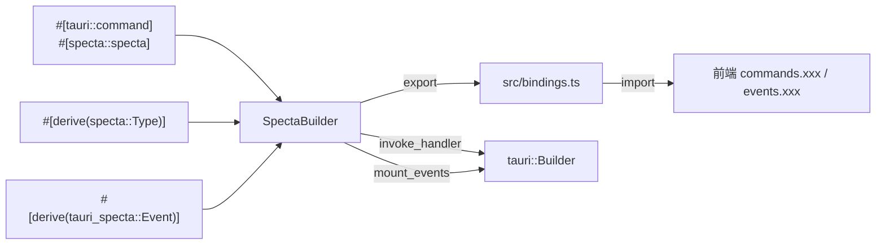
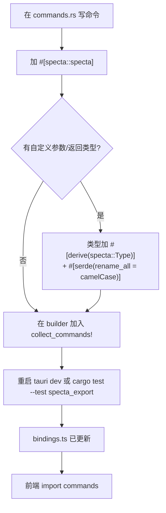

# tauri-specta 开发指南

让 Rust 成为整个 Tauri 应用的**单一类型事实源（single source of truth）**：自动把命令签名 / 数据类型 / 事件搬到前端 TypeScript，让前端 IDE 拿到完整的类型补全与编译期检查。

## 核心心智模型



**三层 crate 分工**：

| Crate | 职责 |
|-------|------|
| `specta` | `#[derive(specta::Type)]` 收集类型 schema |
| `specta-typescript` | 把 schema 翻译成 TS 字符串（含 Layout / header / framework_runtime） |
| `tauri-specta` | 收集 `#[specta::specta]` 命令签名 + `#[derive(Event)]` 事件，提供 `Builder` |

## 30 秒速查表

### 依赖（版本必须锁死）

```toml
specta             = { version = "=2.0.0-rc.25", features = ["derive", "uuid", "chrono", "serde_json"] }
specta-typescript  = "=0.0.12"
tauri-specta       = { version = "=2.0.0-rc.25", features = ["typescript", "derive"] }
```

### 一条命令

```rust
#[tauri::command]
#[specta::specta]                       // ← 关键
pub async fn get_user(
    state: State<'_, AppState>,         // Tauri 注入：自动从 TS 签名剔除
    id: u32,                             // 基本类型：直接映射
) -> Result<User, AppError> { ... }
```

### 一个事件

```rust
#[derive(Debug, Clone, Serialize, specta::Type, tauri_specta::Event)]
pub struct UserCreated(pub User);
```

### Builder 装配

```rust
use tauri_specta::{collect_commands, collect_events, Builder as SpectaBuilder, ErrorHandlingMode};

pub fn specta_builder() -> SpectaBuilder<tauri::Wry> {
    SpectaBuilder::<tauri::Wry>::new()
        .dangerously_cast_bigints_to_number()       // u64/i64 → number
        .error_handling(ErrorHandlingMode::Throw)   // try/catch 而非 Result tuple
        .commands(collect_commands![get_user, create_user])
        .events(collect_events![UserCreated])
}

// 接入 Tauri
let specta = specta_builder();
tauri::Builder::default()
    .invoke_handler(specta.invoke_handler())        // 替代 tauri::generate_handler!
    .setup(move |app| {
        specta.mount_events(app);                    // 没这行 emit 会 panic
        Ok(())
    })
```

### 前端调用

```ts
import { commands, events } from "./bindings";

const user = await commands.getUser(42);            // ^? User
events.userCreated.listen(e => e.payload.name);     // 强类型 payload
```

## 详细文档（按主题）

按需阅读 references 下的专题文档：

- **[references/setup.md](references/setup.md)** — 安装、版本锁、`SpectaBuilder` 完整 API（`Builder::new` / `commands` / `events` / `typ` / `constant` / `plugin_name` / `error_handling` / `disable_serde_phases` / `semantic_types`）、与 `tauri::Builder` 的装配顺序
- **[references/commands.md](references/commands.md)** — `#[specta::specta]`、`collect_commands!` 宏、Tauri 注入参数（`State` / `AppHandle` / `Channel`）剔除规则、async / 泛型命令、参数命名（snake_case ↔ camelCase）、deprecated 标记、第三方类型边界
- **[references/events.md](references/events.md)** — `#[derive(tauri_specta::Event)]`、`#[tauri_specta(event_name = "...")]` 自定义名、newtype + `serde(transparent)` 模式、`Event` trait 全部方法（`listen` / `listen_any` / `once` / `emit` / `emit_to` / `emit_filter`）、kebab-case 自动转换、`mount_events` 注册表
- **[references/types.md](references/types.md)** — `specta::Type` derive、`#[serde(rename_all)]` / `tag` / `transparent` / `flatten` 行为、第三方类型 String 边界、phase-aware serde（`Foo_Serialize` / `Foo_Deserialize`）、`disable_serde_phases`、semantic types（Date / Uint8Array / URL）
- **[references/error-handling.md](references/error-handling.md)** — `ErrorHandlingMode::Throw` vs `Result`、手写 `specta::Type` impl 把内部 enum 投影成前端友好 payload、`thiserror` + 自动 `From` 链路、`typed_error_impl` 接 Effect / 自定义运行时
- **[references/export.md](references/export.md)** — `Typescript` exporter（`header` / `layout` / `framework_prelude` / `framework_runtime` / `branded_type_impl`）、`Layout` 四种模式（`FlatFile` / `Files` / `Namespaces` / `ModulePrefixedName`）、JSDoc 导出、CI 强制导出（test-driven）、`Builder::constant` 注入常量
- **[references/pitfalls.md](references/pitfalls.md)** — `EventRegistry not found` panic、`BigInt forbidden`、`DuplicateTypeName`、derive macro 与 trait 重名遮蔽、`#[serde(rename = "kebab")]` 反作用、`tauri::generate_handler!` 残留、libp2p / SeaORM Entity 等不可控类型的边界处理

## 三条铁律

1. **版本锁死**：`=2.0.0-rc.25`（不要写 `^`），specta v2 还在 rc 阶段，小版本不兼容。
2. **bindings.ts 自动生成**：写过的 `commands.xxx` 出错就重跑导出，**永远别手改产物**。前端业务别名收拢到独立的 `types.ts`。
3. **`mount_events(app)` 与 `invoke_handler` 配对**：注册了 events 却没 mount → 第一次 `.emit()` 立即 panic（`EventRegistry not found in Tauri state`）。

## 接入新命令 / 事件的标准动作



事件流程同理：命令换成事件、`collect_commands!` 换成 `collect_events!`、类型 derive 多加 `tauri_specta::Event`。

## 推荐项目结构

```text
src-tauri/
├── src/
│   ├── lib.rs            # 暴露 specta_builder() / build_app()
│   ├── commands/         # 按业务域拆分命令模块
│   │   ├── mod.rs        # glob re-export __cmd__* 隐藏符号
│   │   ├── user.rs
│   │   └── ...
│   ├── events.rs         # 类型化事件 wrapper（newtype + serde transparent）
│   ├── error.rs          # AppError + specta::Type impl 投影
│   └── setup.rs          # specta_builder() + build_app() 集中装配
└── tests/
    └── specta_export.rs  # cargo test 强制导出 bindings.ts（CI 用）

src/
├── bindings.ts           # 自动生成（不要手改！）
└── types.ts              # 业务别名、聚合类型、运行时 string alias
```

## 官方资源

- 仓库：<https://github.com/specta-rs/tauri-specta>
- docs.rs：<https://docs.rs/tauri-specta/2.0.0-rc.25/tauri_specta/>
- 配套 specta：<https://github.com/specta-rs/specta>
- 示例代码：<https://github.com/specta-rs/tauri-specta/tree/main/examples/app>
