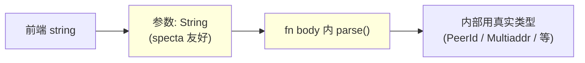

# 命令注册

## 最小骨架

```rust
#[tauri::command]
#[specta::specta]                       // ← 关键
pub async fn hello(name: String) -> String {
    format!("Hello, {name}!")
}
```

然后到 builder 注册：

```rust
SpectaBuilder::<Wry>::new()
    .commands(collect_commands![hello]);
```

`#[specta::specta]` 不能省。`#[tauri::command]` 只是 Tauri 自己的 IPC 注册宏，**它不会**把签名告诉 specta；`#[specta::specta]` 才会把参数/返回的 schema 收集到 builder。

## `collect_commands!` 宏

```rust
collect_commands![
    // 1) 普通函数
    hello,
    // 2) 模块路径
    commands::user::get_user,
    // 3) 泛型（需要显式给参数）
    generic_command::<tauri::Wry>,
]
```

它内部展开成同时调用：

- `tauri::generate_handler![...]`（传给 `invoke_handler`）
- `specta::function::collect_functions![...]`（把 schema 喂给 builder）

所以 **`collect_commands!` 完整替代 `tauri::generate_handler!`**，不要两者同时写。

### glob re-export 的兼容性

`#[tauri::command]` 宏内部会生成 `__cmd__hello` 这样的隐藏符号。`collect_commands!` 走 `::tauri::generate_handler!` 解析路径，需要能通过 `crate::commands::hello` 这种路径访问到隐藏符号。

按业务域拆分模块时的推荐写法：

```rust
// src-tauri/src/commands/mod.rs
mod user;
mod auth;
mod settings;

// glob re-export：__cmd__* 隐藏符号必须通过模块路径访问
pub use user::*;
pub use auth::*;
pub use settings::*;
```

之后 `collect_commands![commands::get_user]` 就能找到隐藏符号。

## 参数处理规则

### Tauri 注入参数 —— 自动从前端签名剔除

specta 识别以下类型为"运行时注入"，**不会**出现在生成的 TS 签名里：

| 类型 | 用途 |
|------|------|
| `tauri::AppHandle` / `tauri::AppHandle<R>` | App 句柄 |
| `tauri::Webview` / `tauri::Window` / `tauri::WebviewWindow` | 窗口句柄 |
| `tauri::State<'_, T>` | 共享状态 |
| `tauri::ipc::Channel<T>` | per-call channel（保留在签名里，类型为 `Channel<T>`） |

> 例外：`Channel<T>` **会**保留在 TS 签名里，前端需要 `new Channel<T>()` 后传进去——它是从前端创建的"回调通道"。

例：

```rust
#[tauri::command]
#[specta::specta]
pub async fn upload_file(
    app: AppHandle,                            // ← 自动剔除
    state: State<'_, AppState>,                // ← 自动剔除
    path: String,                               // ← 留下
    options: UploadOptions,                     // ← 留下
    progress: Channel<UploadProgress>,         // ← 留下（前端需 new Channel）
) -> Result<UploadResult, AppError> { ... }
```

生成的 TS：

```ts
uploadFile: (
    path: string,
    options: UploadOptions,
    progress: Channel<UploadProgress>,
) => Promise<UploadResult>
```

### 命名转换

| Rust | TS |
|------|----|
| `snake_case` 函数名 | `camelCase`（`get_user_info` → `getUserInfo`） |
| `snake_case` 参数名 | `camelCase`（`user_id` → `userId`） |
| 字段名 | 由 `#[serde(rename_all)]` 决定，**不**自动 camelCase |

→ 大部分 specta-friendly 的项目会给每个 struct 加 `#[serde(rename_all = "camelCase")]`。

### 第三方库的类型怎么办？

很多第三方 crate（libp2p `PeerId`、`url::Url` 在某些场景、外部 SDK 类型等）**没有** `specta::Type` impl，无法直接出现在 `#[specta::specta]` 函数签名里。

**解决套路**：在命令边界把它们 toString，进函数后再 `parse()` 回去：

```rust
#[tauri::command]
#[specta::specta]
pub async fn connect_peer(
    peer_id: String,                       // ← 不是 PeerId
    addrs: Vec<String>,                     // ← 不是 Vec<Multiaddr>
) -> Result<ConnectInfo, AppError> {
    let peer_id: PeerId = peer_id.parse()
        .map_err(|e| AppError::Invalid(format!("invalid peer_id: {e}")))?;
    let addrs = addrs
        .into_iter()
        .map(|s| s.parse::<Multiaddr>())
        .collect::<Result<Vec<_>, _>>()
        .map_err(|e| AppError::Invalid(format!("invalid multiaddr: {e}")))?;
    // 之后就是真正的 PeerId / Multiaddr
}
```

代价是多写几行 `parse()`，收益是**整个 IPC 边界保持类型自闭包**，不用为第三方库做特殊适配（也不用 fork 第三方 crate 给它打 `specta::Type` 补丁）。



## async / await

`#[specta::specta]` 完全支持 `async fn`：

```rust
#[tauri::command]
#[specta::specta]
async fn fetch_user(id: u32) -> Result<User, AppError> { ... }
```

生成的 TS：`fetchUser(id: number) => Promise<User>` —— 总是 `Promise<T>`，无论 Rust 是不是 async。

⚠️ **async 命令不能借用参数**（这是 Tauri 的限制，不是 specta 的）：

```rust
// ❌ compile error
async fn bad(name: &str) { ... }

// ✅
async fn good(name: String) { ... }
```

## `Channel<T>` —— per-call 流式回调

适合上传/下载这种"一次调用、多次回执"的场景：

```rust
use tauri::ipc::Channel;

#[derive(Clone, serde::Serialize, specta::Type)]
#[serde(tag = "event", content = "data", rename_all = "camelCase")]
pub enum UploadProgress {
    Scanning { count: u32 },
    Hashing { progress: f32 },
    Done { id: Uuid },
}

#[tauri::command]
#[specta::specta]
pub async fn upload(
    files: Vec<String>,
    on_progress: Channel<UploadProgress>,   // ← 前端传进来的 channel
) -> Result<UploadResult, AppError> {
    // 在长流程中随时推送
    on_progress.send(UploadProgress::Scanning { count: 10 }).ok();
    on_progress.send(UploadProgress::Done { id }).ok();
    Ok(result)
}
```

前端：

```ts
import { Channel } from "@tauri-apps/api/core";

const channel = new Channel<UploadProgress>();
channel.onmessage = (e) => {
    if (e.event === "scanning") console.log(e.data.count);
};
const result = await commands.upload(files, channel);
```

`Channel` 与 `Event` 的取舍：

| 维度 | `Channel<T>` | `Event` |
|------|--------------|---------|
| 生命周期 | 跟随单次命令调用 | 全局，跨命令 |
| 接收者 | 单一（创建 channel 的那个调用） | 任意数量 |
| 适用场景 | 上传/下载进度、长任务步骤 | 网络状态变化、外部事件到来 |

## 泛型命令

```rust
#[tauri::command]
#[specta::specta]
fn generic<T: tauri::Runtime>(app: tauri::AppHandle<T>) -> String { ... }
```

注册时需要显式给参数：

```rust
collect_commands![
    generic::<tauri::Wry>,
]
```

（`tauri::generate_handler!` 本身不支持泛型，`collect_commands!` 帮忙剥掉了 `::<...>`，但 `specta::function::collect_functions!` 那边需要看到具体类型。）

## `#[deprecated]` 标记

会被 specta 识别并在 TS 里加 JSDoc：

```rust
#[deprecated = "Use new_api instead"]
#[tauri::command]
#[specta::specta]
fn old_api() {}
```

生成：

```ts
/** @deprecated Use new_api instead */
oldApi: () => __TAURI_INVOKE<null>("old_api"),
```

## doc comments 也会带过去

```rust
/// 通过 ID 查询用户信息
#[tauri::command]
#[specta::specta]
pub async fn get_user(id: u32) -> Result<User, AppError> { ... }
```

→ 生成的 TS 里会有对应的 JSDoc：

```ts
/**  通过 ID 查询用户信息 */
getUser: (id: number) => __TAURI_INVOKE<User>("get_user", { id }),
```

→ 写 doc comment 一举两得：Rust 内部有文档，TS 调用方也有补全提示。

## 相关

- [types.md](types.md) — 参数/返回类型的 specta::Type 配置
- [error-handling.md](error-handling.md) — `Result<T, E>` 的两种映射方式
- [events.md](events.md) — Channel vs Event 的取舍
