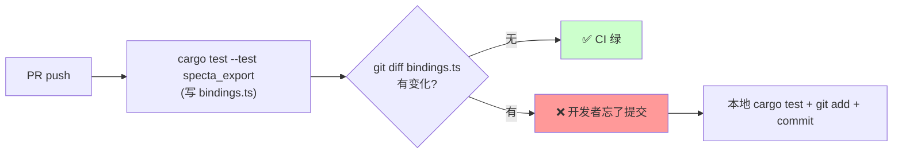

# bindings 导出

## 基本调用

```rust
use specta_typescript::Typescript;

builder.export(
    Typescript::default(),
    "../src/bindings.ts",
)?;
```

`Typescript::default()` 直接可用。`builder.export(language, path)` 是 builder 的最后一步——它读取此时已注册的所有 `commands` / `events` / `types` / `constants`，生成 TS 文件。

## `Typescript` 配置链

```rust
Typescript::default()
    .header("// AUTO-GENERATED. DO NOT EDIT.\n")
    .layout(Layout::FlatFile)
    // ... 其他配置
```

来自 `specta-typescript::Typescript` 与底层 `Exporter`（v0.0.12）：

| 方法 | 用途 |
|------|------|
| `header(impl Into<Cow>)` | 文件顶部加自定义注释（lint 忽略规则、生成时间等） |
| `framework_prelude(impl Into<Cow>)` | 替换默认 prelude（"This file has been generated by Specta..."） |
| `framework_runtime(Fn)` | 注入运行时辅助代码（如 `Date` 转换函数） |
| `layout(Layout)` | 输出布局（见下） |
| `branded_type_impl(Fn)` | 自定义 `specta_typescript::branded!` 类型如何渲染 |
| `export(types, format)` | 导出为字符串 |
| `export_to(path, types, format)` | 导出到文件 |

## `Layout` 四种模式

```rust
pub enum Layout {
    FlatFile,            // 默认：所有类型展平到一个文件
    Files,               // 每个 Rust 模块一个文件
    Namespaces,          // 每个 Rust 模块一个 TS namespace
    ModulePrefixedName,  // 类型名带 module path 前缀，但保持单文件
}
```

```rust
use specta_typescript::{Typescript, Layout};

Typescript::default().layout(Layout::Namespaces)
```

### 用法对比

#### `FlatFile`（默认，推荐）

所有类型平铺在一个 `bindings.ts`：

```ts
export type User = { ... };
export type Post = { ... };
export const commands = { ... };
```

简单，前端 import 容易。**唯一限制**：不允许两个 Rust crate 出现同名 type。

#### `Files`

每个 Rust 模块写一个独立 `.ts` 文件，需要传**目录**给 `export_to`：

```rust
builder.export(
    Typescript::default().layout(Layout::Files),
    "../src/bindings",      // ← 目录
)?;
```

输出：

```
bindings/
├── index.ts
├── user.ts
└── post.ts
```

#### `Namespaces`

每个 Rust 模块产生一个 TS namespace：

```ts
export namespace user {
    export type User = { ... };
}
export namespace post {
    export type Post = { ... };
}
```

前端用 `user.User` 引用。**JSDoc 模式不支持** namespaces，会报错。

#### `ModulePrefixedName`

单文件，但 type 名加 module path 前缀：

```ts
export type UserUser = { ... };       // user::User
export type PostPost = { ... };       // post::Post
```

适合规避 `FlatFile` 的重名冲突，但 type 名变丑。

### 选择建议

| 场景 | 选择 |
|------|------|
| 大多数项目 | `FlatFile`（默认） |
| 跨多个 crate 重名严重 | `Namespaces` 或 `ModulePrefixedName` |
| 前端想按模块 lazy import | `Files` |
| 用 JSDoc 而非 TS | `FlatFile` 或 `Files`（不能用 `Namespaces`） |

## `header` 妙用

最常见用法是注入 lint 忽略 + 生成提示：

```rust
Typescript::default()
    .header("// AUTO-GENERATED by tauri-specta. DO NOT EDIT.\n\
             /* eslint-disable */\n\
             /* prettier-ignore */\n\n")
```

或加生成时间：

```rust
let now = chrono::Utc::now().to_rfc3339();
Typescript::default()
    .header(format!("// Generated at {now}\n"))
```

## `framework_runtime` 注入运行时

如果你想让生成的 `bindings.ts` 里包含自定义 helper（比如自动把 ISO 字符串转 `Date`），用 `framework_runtime`：

```rust
use std::borrow::Cow;

Typescript::default()
    .framework_runtime(|_exporter| {
        Ok(Cow::Borrowed(r#"
function parseDate(s: string): Date { return new Date(s); }
"#))
    })
```

写出的 `bindings.ts` 顶部会带 `parseDate`，命令的反序列化代码可以使用它。

> 大部分场景**不需要**自己写 `framework_runtime`。开 `semantic_types(...)` 就能享受官方实现。

## `Builder::constant` —— 导出常量

把 Rust 里的常量值直接发到前端：

```rust
SpectaBuilder::<Wry>::new()
    .constant("APP_VERSION", env!("CARGO_PKG_VERSION"))
    .constant("BUILD_TIME", build_time::build_time())
    .constant("DEFAULT_BOOTSTRAP_NODES", vec![
        "/ip4/1.2.3.4/tcp/4001",
        "/ip4/5.6.7.8/tcp/4001",
    ]);
```

```ts
// 自动生成
export const APP_VERSION: string = "1.2.3";
export const BUILD_TIME: string = "2026-05-20T12:00:00Z";
export const DEFAULT_BOOTSTRAP_NODES: string[] = ["...", "..."];
```

`constant<T: Serialize + Type>(k, v)` 签名要求 `T: Type`，所以可以塞任意可 serde 的 Rust 值。

## 何时触发导出

`builder.export()` 调用时机决定 bindings 何时更新。常见三种：

### 1. debug build 启动时（开发友好）

```rust
pub fn build_app() -> Builder<Wry> {
    let specta = specta_builder();

    #[cfg(debug_assertions)]
    {
        if let Err(e) = specta.export(Typescript::default(), "../src/bindings.ts") {
            tracing::warn!("export failed: {e}");
        }
    }

    Builder::default()
        .invoke_handler(specta.invoke_handler())
        // ...
}
```

**优点**：每次 `tauri dev` 启动顺手刷新，不漏。
**缺点**：CI 跑 `cargo build` 不启动 app，**不会**触发 export，bindings 可能滞后。

### 2. cargo test 强制导出（CI 友好，推荐）

把 export 抽到独立测试里：

```rust
// src-tauri/tests/specta_export.rs
use specta_typescript::Typescript;

#[test]
fn export_bindings() {
    let builder = my_app_lib::specta_builder();
    builder
        .export(
            Typescript::default()
                .header("// AUTO-GENERATED by tauri-specta. DO NOT EDIT.\n"),
            "../src/bindings.ts",
        )
        .expect("Failed to export specta TypeScript bindings");
}
```

跑：

```bash
cargo test --test specta_export
```

CI workflow 加一步：

```yaml
- run: cargo test --test specta_export
- run: git diff --exit-code src/bindings.ts || (echo "bindings drift" && exit 1)
```

**`git diff --exit-code`** 会在 bindings 和 commit 不一致时让 CI 红灯。这就是"**bindings 永远不漂移**"的关键机制。



### 3. release build 不导出（避免误覆盖）

```rust
#[cfg(debug_assertions)]
specta.export(...)?;
```

release build 跳过 export，避免覆盖用户已签入的 bindings。

## JSDoc 替代 TypeScript

如果项目用 plain JS + JSDoc：

```toml
tauri-specta = { version = "=2.0.0-rc.25", features = ["javascript", "derive"] }
```

```rust
use specta_typescript::JSDoc;

builder.export(JSDoc::default(), "../src/bindings.js")?;
```

JSDoc 支持的 `Layout` 子集：`FlatFile` / `Files`，**不支持** `Namespaces`。

## 与 prettier / biome 集成

specta-typescript 本身**不**调 formatter。生成的 TS 可读但缩进风格固定。常见做法是 export 后跑 formatter：

```bash
# 流程：
cargo test --test specta_export   # 写出 bindings.ts
pnpm prettier --write src/bindings.ts
```

或在 export 后立即调用：

```rust
#[cfg(debug_assertions)]
{
    builder.export(Typescript::default(), "../src/bindings.ts")?;
    let _ = std::process::Command::new("pnpm")
        .args(["prettier", "--write", "../src/bindings.ts"])
        .status();
}
```

> 实际开发中通常不重要——bindings.ts 是机器生成的，可读性已经够用，不强求 prettier-perfect。

## 相关
- [setup.md](setup.md) — `Builder::export` 在装配流程里的位置
- [types.md](types.md) — `semantic_types` 让 `framework_runtime` 自动注入
- [pitfalls.md](pitfalls.md) — Layout 与 DuplicateTypeName 关联坑
