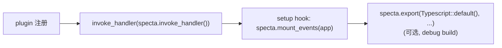

# 安装与 Builder 装配

## 依赖

```toml
[dependencies]
specta             = { version = "=2.0.0-rc.25", features = ["derive", "uuid", "chrono", "serde_json"] }
specta-typescript  = "=0.0.12"
tauri-specta       = { version = "=2.0.0-rc.25", features = ["typescript", "derive"] }
```

**版本必须用 `=` 锁死**。specta v2 还在 rc 阶段，patch 版本之间会有破坏性变更（type schema 二进制不兼容会导致 `tauri-specta` 编译失败）。

### feature 选择

`tauri-specta` 的 features：

| Feature | 用途 |
|---------|------|
| `derive` | 启用 `#[derive(tauri_specta::Event)]` 宏。**用 events 必开** |
| `typescript` | 启用 TS 导出（搭配 `specta-typescript`） |
| `javascript` | 启用 JSDoc 导出（搭配 `specta-jsdoc`） |

`specta` 的常用 feature：

| Feature | 用途 |
|---------|------|
| `derive` | `#[derive(specta::Type)]` 宏 |
| `uuid` / `chrono` / `serde_json` / `url` / `bytes` | 给对应 crate 的常用类型加上 `Type` impl |

### 多 crate workspace 的隔离技巧

如果业务逻辑放在独立 core crate（`crates/core`），不希望核心库强依赖 specta，可以把 derive 挂在 optional feature 后：

```rust
// crates/core/src/types.rs
#[cfg_attr(feature = "specta", derive(specta::Type))]
#[derive(Debug, Clone, Serialize, Deserialize)]
pub struct User { ... }
```

```toml
# crates/core/Cargo.toml
[features]
specta = ["dep:specta"]

[dependencies]
specta = { workspace = true, optional = true }
```

桌面壳启用：

```toml
# src-tauri/Cargo.toml
my-core = { workspace = true, features = ["specta"] }
```

这样 core 可以被其他 host（移动端、CLI、headless server）复用，不被 Tauri 生态绑死。

## `SpectaBuilder` 完整 API

来自 `tauri_specta::Builder<R>`（v2.0.0-rc.25）：

```rust
impl<R: Runtime> Builder<R> {
    pub fn new() -> Self;

    /// 用于 plugin 命令的命名空间前缀
    pub fn plugin_name(mut self, plugin_name: &'static str) -> Self;

    /// 注册命令。⚠️ 会覆盖前一次调用
    pub fn commands(mut self, commands: Commands<R>) -> Self;

    /// 注册事件。⚠️ 会覆盖前一次调用
    pub fn events(mut self, events: Events) -> Self;

    /// 单独导出某个类型（不通过命令/事件链路引入）
    pub fn typ<T: Type>(mut self) -> Self;

    /// 批量导出一组类型
    pub fn types(mut self, types: &Types) -> Self;

    /// 把一个常量值导出到前端（生成 `export const NAME = ...`）
    pub fn constant<T: Serialize + Type>(
        mut self,
        k: impl Into<Cow<'static, str>>,
        v: T,
    ) -> Self;

    /// 错误处理模式：Throw / Result（默认 Result）
    pub fn error_handling(mut self, mode: ErrorHandlingMode) -> Self;

    /// 替换前端 `typedError` 实现（接 Effect / 其他 Result 库）
    pub fn typed_error_impl(mut self, runtime: impl Into<Cow<'static, str>>) -> Self;

    /// 启用 semantic types（Date / Uint8Array / URL 等运行时映射）
    #[cfg(any(feature = "javascript", feature = "typescript"))]
    pub fn semantic_types(mut self, cfg: specta_typescript::semantic::Configuration) -> Self;

    /// u64/i64/usize/isize/u128/i128/f128 强制映射为 TS number（默认会报 BigInt forbidden）
    #[cfg(any(feature = "javascript", feature = "typescript"))]
    pub fn dangerously_cast_bigints_to_number(mut self) -> Self;

    /// 关闭按 serde 阶段（serialize/deserialize）拆分类型（默认开启 phase-aware）
    pub fn disable_serde_phases(mut self) -> Self;

    /// 替代 tauri::generate_handler! 的 IPC 入口
    pub fn invoke_handler(&self) -> impl Fn(Invoke<R>) -> bool + Send + Sync + 'static;

    /// 把 events 注册到 Tauri State —— setup hook 里必调
    pub fn mount_events(&self, handle: &impl Manager<R>);

    /// 把 bindings 写到文件系统
    pub fn export<L: LanguageExt>(
        &self,
        language: L,
        path: impl AsRef<Path>,
    ) -> Result<(), L::Error>;
}
```

`ErrorHandlingMode`：

```rust
pub enum ErrorHandlingMode {
    Throw,            // 前端 await + try/catch
    Result,           // 前端拿 { status: "ok" | "error", ... } tuple（默认）
}
```

## 标准装配模式（推荐）

把 builder 装配拆成两个公开函数，便于测试单独跑 export：

```rust
// src-tauri/src/setup.rs
use tauri::{Builder, Manager, Wry};
use tauri_specta::{collect_commands, collect_events, Builder as SpectaBuilder, ErrorHandlingMode};

/// 单独抽出，便于测试 / CI 调用，不依赖完整 tauri::Builder 启动。
pub fn specta_builder() -> SpectaBuilder<Wry> {
    SpectaBuilder::<Wry>::new()
        .dangerously_cast_bigints_to_number()
        .error_handling(ErrorHandlingMode::Throw)
        .commands(collect_commands![
            commands::get_user,
            commands::create_user,
            // ...
        ])
        .events(collect_events![
            events::UserCreated,
            events::UserDeleted,
            // ...
        ])
}

pub fn build_app() -> Builder<Wry> {
    let specta = specta_builder();

    // debug build：每次启动顺手导出
    #[cfg(debug_assertions)]
    {
        use specta_typescript::Typescript;
        if let Err(e) = specta.export(
            Typescript::default()
                .header("// AUTO-GENERATED by tauri-specta. DO NOT EDIT.\n"),
            "../src/bindings.ts",
        ) {
            tracing::warn!("Failed to export specta TS bindings: {e}");
        }
    }

    Builder::default()
        // ... 你的 plugin 注册
        .invoke_handler(specta.invoke_handler())   // ← 替代 tauri::generate_handler!
        .setup(move |app| {
            specta.mount_events(app);              // ← 否则 emit 会 panic
            // ... 你原来的 setup
            Ok(())
        })
}
```

## 装配顺序铁律



要点：

1. `specta.invoke_handler()` **取代**了 `tauri::generate_handler![...]` 整行。两者只能选一个，残留旧 macro 会导致命令注册重复 / 不一致。
2. `mount_events(app)` 必须在 `setup` 闭包里调，且必须在第一次 `Event::emit()` 之前——否则 panic：`EventRegistry not found in Tauri state - Did you forget to call Builder::mount_events?`
3. `export` 调用本身**不会**注册命令，纯粹是落盘。可以放在 `setup` 外或内，只要在 `build_app()` 早期触发即可。
4. `Builder` 实现了 `Clone`，可以在多个上下文用同一个实例。但通常 `let specta = specta_builder();` 之后传引用更清晰。

## 一个最小可运行例子

```rust
#![cfg_attr(all(not(debug_assertions), target_os = "windows"), windows_subsystem = "windows")]

use serde::Serialize;
use specta::Type;
use specta_typescript::Typescript;
use tauri_specta::{collect_commands, collect_events, Builder, Event};

#[tauri::command]
#[specta::specta]
fn greet(name: String) -> String {
    format!("Hello, {name}!")
}

#[derive(Debug, Clone, Serialize, Type, Event)]
pub struct Pinged(String);

fn main() {
    let builder = Builder::<tauri::Wry>::new()
        .commands(collect_commands![greet])
        .events(collect_events![Pinged]);

    #[cfg(debug_assertions)]
    builder
        .export(Typescript::default(), "../src/bindings.ts")
        .expect("export failed");

    tauri::Builder::default()
        .invoke_handler(builder.invoke_handler())
        .setup(move |app| {
            builder.mount_events(app);
            Pinged("hello".into()).emit(app).ok();
            Ok(())
        })
        .run(tauri::generate_context!())
        .expect("error while running tauri application");
}
```

## 相关

- [commands.md](commands.md) — 命令注册细节
- [events.md](events.md) — 事件 derive 与挂载
- [export.md](export.md) — 导出选项与测试驱动
- [pitfalls.md](pitfalls.md) — 装配阶段最容易踩的几个坑
