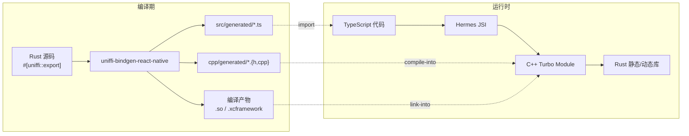
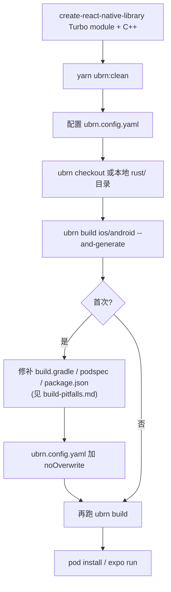

# uniffi-bindgen-react-native 开发指南

> 把 Rust 写一次,iOS / Android / Web 都能用,前端拿到完整 TypeScript 类型补全。

## 心智模型

`uniffi-bindgen-react-native`(下文统称 **ubrn**)基于 Mozilla UniFFI,在 Rust 上加 `#[uniffi::export]` 注解 → 自动生成 **TypeScript 类型 + C++ JSI 绑定** → 装成标准 React Native Turbo Module。

运行时调用链:**TypeScript → Hermes JSI → C++ → Rust**,全程**无 JSON 序列化**(对比 Tauri 的 WebView fetch + serde 二次序列化)。



## 与同类方案对比

| | uniffi-bindgen-react-native | Expo Modules + C FFI | Ferric (Node-API) |
|---|---|---|---|
| 原理 | UniFFI proc-macro → JSI C++ | 手写 Swift/Kotlin FFI 包装 | napi-rs → Hermes Node-API |
| 类型安全 | ✅ 编译时生成 TS 类型 | ❌ 手动维护 | ✅ 生成 TS 类型 |
| async | ✅ async fn → Promise + AbortSignal | ⚠️ 手动回调 | ✅ async fn → Promise |
| 回调 | ✅ callback_interface trait | ⚠️ 手动事件桥接 | ⚠️ 有限支持 |
| 平台 | iOS + Android + Web(WASM) | iOS + Android | iOS + Android |
| 成熟度 | 生产就绪(Mozilla / Firefox 移动端) | 稳定但繁琐 | 早期(依赖自定义 Hermes) |

> **改名预告**:由于新增 WASM 支持,项目计划改名为 `uniffi-bindgen-javascript`,会保持向后兼容(见上游 README "Notice" 段)。

## 30 秒速查

### 一个 Rust 函数

```rust
#[uniffi::export]
pub fn greet(name: String) -> String {
    format!("Hello, {name}!")
}
```

### 一个对象 + async 方法

```rust
#[derive(uniffi::Object)]
pub struct MyClient { /* ... */ }

#[uniffi::export(async_runtime = "tokio")]  // ⚠️ 用 tokio reactor 必须显式声明
impl MyClient {
    #[uniffi::constructor]
    pub async fn new(data_dir: String) -> Self { /* ... */ }

    pub async fn fetch(&self, url: String) -> Result<String, MyError> { /* ... */ }
}
```

### 一个事件回调

```rust
#[uniffi::export(with_foreign)]                   // 推荐 Foreign Trait,JS 与 Rust 双向
pub trait EventListener: Send + Sync {
    fn on_event(&self, payload: EventPayload);
}

#[uniffi::export]
fn register_listener(listener: Arc<dyn EventListener>) { /* ... */ }
```

### TS 端

```typescript
import { MyClient, greet, registerListener, type EventPayload } from "my-rust-lib";

const msg = greet("World");
const client = await MyClient.new("/data");
const result = await client.fetch("https://example.com");
client.uniffiDestroy();                                   // 持有昂贵资源时显式释放

registerListener({
    onEvent(payload: EventPayload) { /* ... */ }
});
```

## ubrn.config.yaml 最小化

```yaml
---
rust:
  directory: ./rust                # 或 repo: <git url> + branch
  manifestPath: Cargo.toml

bindings:
  cpp: cpp/generated
  ts: src/generated

noOverwrite:                       # 关键:保护手改过的 build 文件
  - "*.podspec"
  - android/build.gradle
  - package.json
  - CMakeLists.txt
```

## 推荐 package.json 脚本

```json
{
  "scripts": {
    "ubrn:ios":      "ubrn build ios     --config ubrn.config.yaml --and-generate && (cd example/ios && pod install)",
    "ubrn:android":  "ubrn build android --config ubrn.config.yaml --and-generate",
    "ubrn:web":      "ubrn build web     --config ubrn.config.yaml",
    "ubrn:checkout": "ubrn checkout      --config ubrn.config.yaml",
    "ubrn:clean":    "rm -rfv cpp/ android/CMakeLists.txt android/src/main/java android/*.cpp ios/ src/Native* src/index.*ts* src/generated/"
  }
}
```

## 详细文档(按主题)

按需阅读 references 下的专题文档:

- **[references/setup.md](references/setup.md)** — 环境准备、create-react-native-library 脚手架、`ubrn.config.yaml` 完整字段(rust/bindings/android/ios/web/turboModule/noOverwrite)、CLI 命令(`checkout`/`build`/`generate`)、目录结构与生成文件清单
- **[references/type-mappings.md](references/type-mappings.md)** — 标量 / 容器 / `uniffi::Record` / `uniffi::Object` / `uniffi::Enum`(简单+tagged union+判别值)、snake_case ↔ camelCase 自动转换、`SystemTime` / `Duration` / `Vec<u8>` 映射、Trait 自动 impl(Display/Debug/Eq/Hash/Ord)、`${OBJECT_NAME}Interface` 生成规则
- **[references/async-and-callbacks.md](references/async-and-callbacks.md)** — `async fn` → Promise、`async_runtime = "tokio"` 必要性、AbortSignal 取消机制、callback_interface vs Foreign Trait(`Box<>` vs `Arc<>`)、async callback、跨 crate trait impl
- **[references/error-memory-threading.md](references/error-memory-threading.md)** — `uniffi::Error`、`#[uniffi(flat_error)]` + `thiserror`、`instanceOf` 替代 `instanceof`、`_Tags` enum + switch 模式、GC + `uniffiDestroy()` / `uniffiUse()`、Mutex 与 JS callback 的死锁三规则、WASM 单线程 `async_trait(?Send)`
- **[references/multi-crate-and-publish.md](references/multi-crate-and-publish.md)** — Megazord 工作区结构、单一入口 crate re-export、跨 crate 类型重名限制、预编译 vs 源码发布、`npm pack --dry-run` 验证、`.gitignore` ↔ `files` 数组交互
- **[references/build-pitfalls.md](references/build-pitfalls.md)** — **生产实践中真实遇到的 8 类构建坑**:iOS deployment target 错配、async static 生成 bug、Windows `\\?\` 长路径(PR #367)、`SystemConfiguration` framework 丢失、RN 0.76+ codegen duplicate symbols、`includesGeneratedCode` 陷阱、New Architecture 条件判断幻象、podspec 兼容性代码

## 三条铁律

1. **生成代码不要手改**(`cpp/generated/` 和 `src/generated/`)。修 Rust 然后重跑 `ubrn build`,任何手改下次 `--and-generate` 就被覆盖。例外:已知的上游 bug(如 `async static` 模板)需用 fix 脚本处理。
2. **持有昂贵资源的 Object 用 `uniffiDestroy()`**。GC 时机不可控,网络连接/文件句柄/数据库句柄不要等 GC。
3. **持有 Mutex 时不要调 JS callback**。Rust 后台线程调 callback 会阻塞等返回,callback 在 JS 主线程,主线程上的其他 Rust 调用如果想拿同一把锁就死锁。

## 接入流程



## 官方资源

- 仓库:<https://github.com/jhugman/uniffi-bindgen-react-native>
- 文档:<https://jhugman.github.io/uniffi-bindgen-react-native/>
- 上游 UniFFI:<https://mozilla.github.io/uniffi-rs/latest/>
- 示例:[uniffi-starter](https://github.com/jhugman/uniffi-starter) / [futures fixture](https://github.com/jhugman/uniffi-bindgen-react-native/tree/main/fixtures/futures)
- 业内使用者:`@unomed/react-native-matrix-sdk`、ChessTiles(iOS)、`@fressh/react-native-uniffi-russh`
