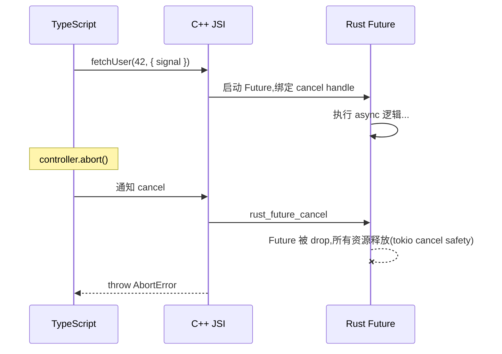

# async fn、Promise、AbortSignal、Callback、Foreign Trait

## async fn → Promise

Rust 的 `async fn` 自动映射为 JS 的 `Promise`:

```rust
#[uniffi::export]
pub async fn fetch_user(id: u32) -> User {
    // 用 tokio / async-std 等任意 async runtime
    let row = db().query("...", id).await;
    User::from(row)
}
```

```typescript
const user = await fetchUser(42);
//    ^? User
```

### ⚠️ `async_runtime = "tokio"` 是关键

`#[uniffi::export] impl` 块里**只要含 `async fn`**,如果依赖 `tokio::fs` / `tokio::time` / `sea-orm` / 任何"需要 tokio reactor"的 future,**必须**在 export 上显式声明:

```rust
#[uniffi::export(async_runtime = "tokio")]    // ← 不写就 panic
impl MyClient {
    pub async fn fetch(&self, url: String) -> Result<String, MyError> { ... }
}
```

`Cargo.toml` 也要开 tokio feature:

```toml
[dependencies]
uniffi = { version = "0.31", features = ["cli", "build", "tokio"] }
```

**症状**(没加 `async_runtime = "tokio"` 的情况):

```text
panic: there is no reactor running, must be called from the context of a Tokio 1.x runtime
```

通常在 JS 第一次 `await client.fetch(...)` 时出现,**栈跟踪看不到具体原因**,只有 adb logcat / Xcode console 能看到 `no reactor running`。Rust 端 panic 会以 `[Error: Rust panic]` 形式抛到 JS。

所有含 `async fn` 的 impl 块都要标。模块级 async 函数同理(不在 impl 块的情况)。

### async 限制

- ✅ async fn 作为顶层函数和 Object 方法
- ✅ async constructor (`#[uniffi::constructor] pub async fn new(...)`)
- ✅ `Result<T, E>` 返回(rejected Promise 携带类型化错误)
- ❌ **不能**把 `Promise` / `Future` 当作参数传入
- ❌ **不能**把 `Promise` / `Future` 作为 Result 的错误类型

### async constructor 的已知模板坑

ubrn ≤ 0.31.0-2 在 async constructor 上有 TS 生成 bug:

```text
SyntaxError: Unexpected token, expected "(" ...
  async static create(...)
        ^^^^^^
```

修法见 [build-pitfalls.md](build-pitfalls.md) 的"async static 模板 bug"段。

## AbortSignal 取消(每个 async fn 自动支持)

uniffi 为每个返回 `Promise` 的函数自动加一个可选的最后参数 `{ signal?: AbortSignal }`:

```typescript
const controller = new AbortController();
setTimeout(() => controller.abort(), 10_000);    // 10 秒超时

try {
    const result = await fetchUser(42, { signal: controller.signal });
} catch (e: any) {
    e instanceof Error;              // true
    e.name === "AbortError";         // true
}
```

取消时发生的事:



### 协作式取消的注意

uniffi 用 [`rust_future_cancel`](https://docs.rs/uniffi/latest/uniffi/ffi/fn.rust_future_cancel.html) 实现:**drop Future**。这是 Rust async 的标准取消机制——`.await` 点会被 cancel,但 Rust 同步代码块**不会**被中断。

如果业务需要更细粒度取消(比如长 CPU 循环里的取消点),按 uniffi-rs 官方建议:

> 自行暴露 `cancel()` 方法,设置标志位,代码定期检查。

```rust
#[derive(uniffi::Object)]
pub struct LongJob {
    cancel: AtomicBool,
}

#[uniffi::export]
impl LongJob {
    pub fn cancel(&self) {
        self.cancel.store(true, Ordering::Relaxed);
    }

    pub async fn run(&self) -> Result<(), AppError> {
        for chunk in chunks {
            if self.cancel.load(Ordering::Relaxed) {
                return Err(AppError::Cancelled);
            }
            process(chunk).await;
        }
        Ok(())
    }
}
```

## Callback Interface:Rust 调 JS

适合"事件推送"——网络事件、同步进度、外部状态变化。

### 基本模式

```rust
#[uniffi::export(callback_interface)]
pub trait EventListener: Send + Sync {
    fn on_connected(&self, peer_id: String, device_name: String);
    fn on_progress(&self, completed: u32, total: u32);
    fn on_failed(&self, message: String);
}

#[uniffi::export]
pub async fn start_task(
    config: TaskConfig,
    listener: Box<dyn EventListener>,           // ⚠️ Box,不是 Arc
) -> Result<(), AppError> {
    listener.on_connected("peer-1".into(), "Bob's iPhone".into());
    for i in 0..10 {
        listener.on_progress(i, 10);
        tokio::time::sleep(Duration::from_millis(100)).await;
    }
    Ok(())
}
```

TS 端实现 + 调用:

```typescript
class MyListener implements EventListener {
    onConnected(peerId: string, deviceName: string): void {
        console.log(`peer ${peerId} connected`);
    }
    onProgress(completed: number, total: number): void { /* ... */ }
    onFailed(message: string): void { /* ... */ }
}

await startTask({ /* ... */ }, new MyListener());
```

### 带返回值的回调

回调方法可以返回值给 Rust:

```rust
#[uniffi::export(callback_interface)]
pub trait ConflictResolver: Send + Sync {
    fn resolve(&self, local: String, remote: String) -> bool;   // 返回 true 用本地
}
```

```typescript
class MyResolver implements ConflictResolver {
    resolve(local: string, remote: string): boolean {
        return confirm(`保留本地 "${local}"?`);
    }
}
```

### 带错误的回调

```rust
#[derive(uniffi::Error)]
pub enum StorageError {
    DiskFull,
    PermissionDenied,
}

#[uniffi::export(callback_interface)]
pub trait Storage: Send + Sync {
    fn write(&self, key: String, data: Vec<u8>) -> Result<(), StorageError>;
}
```

```typescript
class MyStorage implements Storage {
    write(key: string, data: ArrayBuffer): void {
        if (!hasSpace) throw new StorageError.DiskFull();
        // 保存...
    }
}
```

Rust 端:

```rust
match storage.write("key".into(), data) {
    Err(StorageError::DiskFull) => { /* ... */ }
    Ok(()) => { /* ... */ }
}
```

## Foreign Trait:Rust 和 JS 都可以实现

比 `callback_interface` 更通用——同一个 trait 在两个方向都能传:

```rust
#[uniffi::export(with_foreign)]                  // ← 关键
pub trait Logger: Send + Sync {
    fn log(&self, level: LogLevel, message: String);
}

// Rust 端也能实现
#[derive(uniffi::Object)]
pub struct FileLogger { /* ... */ }

#[uniffi::export]
impl Logger for FileLogger {
    fn log(&self, level: LogLevel, message: String) { /* 写文件 */ }
}

// 接收 trait object —— 可能是 JS 实现,也可能是 Rust 实现
#[uniffi::export]
fn set_logger(logger: Arc<dyn Logger>) { /* ... */ }    // ⚠️ Arc,不是 Box
```

### `Box` vs `Arc`:为什么有两个变种?

| 维度 | `callback_interface` | `with_foreign` |
|------|----------------------|----------------|
| trait object 类型 | `Box<dyn T>` | `Arc<dyn T>` |
| 谁能 impl | 只能 JS impl 传给 Rust | Rust + JS 都能 impl |
| 适合场景 | 一次性事件监听器 | 跨多个调用复用的依赖注入 |

**TS 端无感知**——实现 trait 的语法一致。区别在 Rust 端的接收类型与所有权语义。

### 跨 crate 实现 trait

`with_foreign` trait 在 crate A 定义,在 crate B 接收:JS 端可以从 A 的 bindings import trait,实现后传给 B 的函数。不需要额外注解。

```rust
// crate A
#[uniffi::export(with_foreign)]
pub trait Provider: Send + Sync {
    fn fetch(&self) -> String;
}

// crate B(依赖 A)
#[uniffi::export]
fn run_with(p: Arc<dyn Provider>) -> String {
    p.fetch()
}
```

```typescript
import { Provider } from "crateA-bindings";
import { runWith } from "crateB-bindings";

const tsImpl: Provider = {
    fetch(): string { return "from TS"; }
};
runWith(tsImpl);
```

## Async Callback

callback 方法本身也能 async:

```rust
#[uniffi::export(with_foreign)]
#[async_trait::async_trait]
pub trait Fetcher: Send + Sync {
    async fn get(&self, url: String) -> String;
}

#[uniffi::export]
async fn fetch_with(fetcher: Arc<dyn Fetcher>, url: String) -> String {
    fetcher.get(url).await
}
```

TS 实现:

```typescript
class TsFetcher implements Fetcher {
    async get(url: string, asyncOptions?: { signal: AbortSignal }): Promise<string> {
        const r = await fetch(url, asyncOptions);    // 支持原生 fetch 取消
        return r.text();
    }
}

await fetchWith(new TsFetcher(), "https://example.com");
```

uniffi 为每个 async callback 方法自动加 `asyncOptions?: { signal: AbortSignal }` 参数,实现可选择使用。

## 实践:选 callback / event / channel?

| 需求 | 选择 |
|------|------|
| Rust → JS 单次流式回调(上传进度) | `callback_interface` + `Box<dyn T>` |
| Rust → JS + JS → Rust 双向 trait(依赖注入、跨 crate) | `with_foreign` + `Arc<dyn T>` |
| 全局广播事件(网络状态变化) | `with_foreign` + Rust 端维护一个 `Arc<dyn EventBus>` |
| 异步 callback(JS 也得 await) | callback trait 标 `async fn` |

下面是一个典型的事件总线 pattern:

```rust
#[uniffi::export(with_foreign)]
pub trait EventBus: Send + Sync {
    fn emit(&self, event: AppEvent);
}

#[derive(uniffi::Object)]
pub struct AppCore {
    bus: Arc<dyn EventBus>,
    // ...
}

#[uniffi::export(async_runtime = "tokio")]
impl AppCore {
    #[uniffi::constructor]
    pub fn new(bus: Arc<dyn EventBus>) -> Arc<Self> {
        Arc::new(Self { bus, /* ... */ })
    }

    pub async fn do_work(&self) {
        self.bus.emit(AppEvent::Started);
        // ... 工作 ...
        self.bus.emit(AppEvent::Completed);
    }
}
```

TS 端:

```typescript
const bus: EventBus = {
    emit(event: AppEvent) {
        switch (event.tag) {
            case AppEvent_Tags.Started: store.setRunning(true); break;
            case AppEvent_Tags.Completed: store.setRunning(false); break;
        }
    }
};
const core = AppCore.new(bus);
await core.doWork();
```

⚠️ **从 Rust 后台线程调 `bus.emit(...)` 时小心死锁**——见 [error-memory-threading.md](error-memory-threading.md) 的"线程模型"。

## 相关
- [type-mappings.md](type-mappings.md) — `Box` / `Arc<dyn>` 与 Object 生命周期
- [error-memory-threading.md](error-memory-threading.md) — callback 触发的死锁场景
- [build-pitfalls.md](build-pitfalls.md) — async constructor 模板 bug、tokio reactor 必加注解
