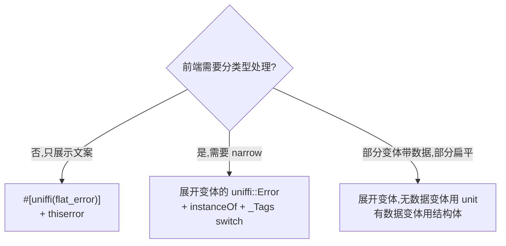
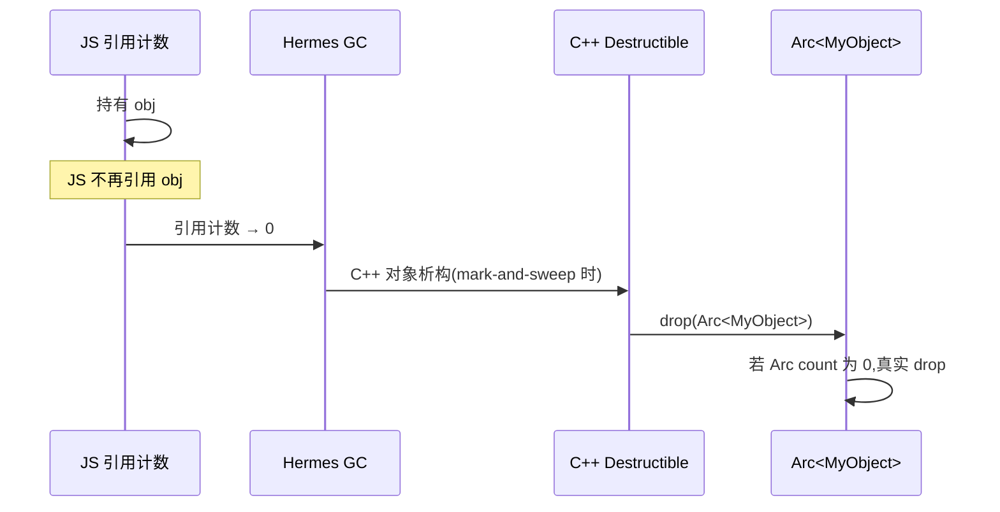
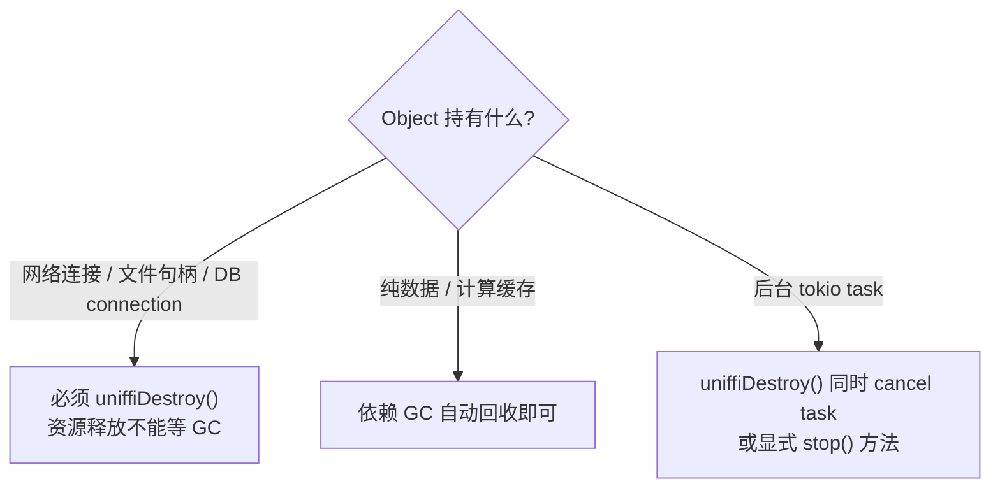
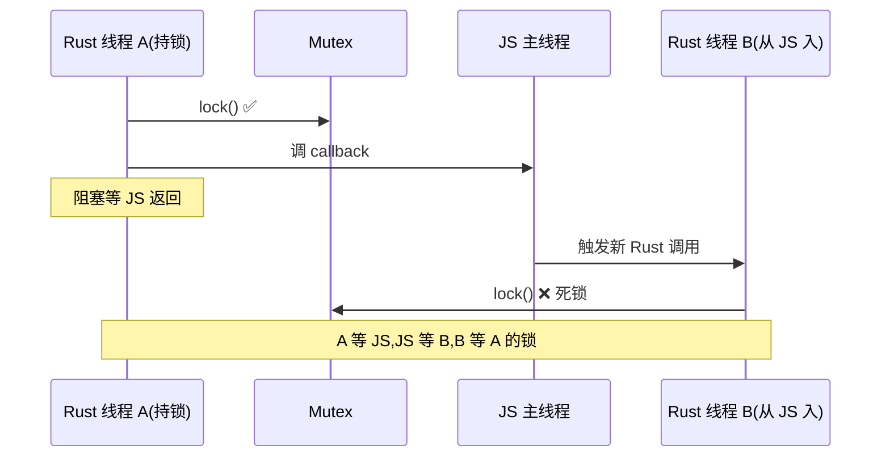

# 错误处理、内存管理、线程模型

## 错误处理

### `Result<T, E>` → reject 的 Promise

```rust
#[derive(uniffi::Error)]
pub enum DbError {
    NotFound,
    ConnectionFailed,
    Corrupted { details: String },
}

#[uniffi::export]
fn find_user(id: u32) -> Result<User, DbError> { /* ... */ }
```

```typescript
try {
    const user = findUser(42);
} catch (e: any) {
    if (DbError.instanceOf(e)) {                     // 整族判断
        if (DbError.NotFound.instanceOf(e)) {        // 具体变体
            console.log("user not found");
        }
        if (DbError.Corrupted.instanceOf(e)) {
            console.error(e.inner.details);
        }
    }
}
```

### ⚠️ 必须用 `instanceOf` 静态方法,不是 `instanceof`

```typescript
// ❌ 不工作 ——Babel 转译限制,enum-as-error 的子类 instanceof 总是 false
if (e instanceof DbError) { /* 永远不进 */ }

// ✅ 用 uniffi 生成的静态方法
if (DbError.instanceOf(e)) { /* ... */ }
if (DbError.NotFound.instanceOf(e)) { /* ... */ }
```

### `_Tags` enum + switch 模式

每个 `uniffi::Error` 都伴随一个 `*_Tags` enum,可以用 `switch` 写穷尽分支:

```typescript
try {
    findUser(42);
} catch (e: any) {
    if (DbError.instanceOf(e)) {
        switch (e.tag) {
            case DbError_Tags.NotFound:
                console.log("not found");
                break;
            case DbError_Tags.Corrupted:
                console.error(e.inner.details);
                break;
            case DbError_Tags.ConnectionFailed:
                console.error("connection failed");
                break;
        }
    }
}
```

### 命名冲突:Rust `Error` → TS `Exception`

如果 Rust 的错误类型就叫 `Error`,生成的 TS 会自动重命名为 `Exception`(避免与 ECMAScript 内置 `Error` 冲突)。

```rust
#[derive(uniffi::Error)]
pub enum Error { /* ... */ }
```

→ TS 端是 `Exception`,前端 import 时注意。

### `#[uniffi(flat_error)]` + `thiserror`:扁平错误

如果只需要错误消息而不需要结构化数据,用 `flat_error`:

```rust
#[derive(Debug, thiserror::Error, uniffi::Error)]
#[uniffi(flat_error)]
pub enum AppError {
    #[error("not connected to network")]
    NetworkUnavailable,

    #[error("parse failed at line {line}, col {col}")]
    ParseError { line: usize, col: usize },          // 字段被吃掉,只剩 message

    #[error(transparent)]
    Other(#[from] std::io::Error),                   // io::Error 自动转
}
```

JS 端拿到的就是普通 `Error`,`message` 是 `#[error(...)]` 文本。字段不单独暴露——前端只看到 `e.message`。

适合"用户层错误"——前端不需要 narrow 到具体变体,只展示文案。如果你需要 narrow,**不要**用 `flat_error`。

### 推荐错误结构



### Object as Error(高级用法)

Rust 不止 enum 能当错误,struct 也能:

```rust
#[derive(uniffi::Object, Debug, thiserror::Error)]
#[error("HTTP {code}: {message}")]
pub struct HttpError {
    pub code: u16,
    pub message: String,
}

#[uniffi::export]
impl HttpError {
    pub fn code(&self) -> u16 { self.code }
    pub fn message(&self) -> String { self.message.clone() }
}
```

TS 端 `error.code` / `error.message()` 直接访问。

## 内存管理

### Hermes GC 与 Rust drop



**问题**:Hermes [尚不支持 `FinalizationRegistry`](https://github.com/facebook/hermes/issues/1440),uniffi 用"每个 JS 对象后面挂一个 C++ `DestructibleObject`"代替。C++ 析构发生在 GC sweep 阶段。

**两条经验法则**:

- GC **可能比你想的晚**——短跑测试 / 应用闲置时,GC 可能根本不跑
- GC **可能比你想的早**——release build 优化激进时,JS 局部变量提前回收 → Rust 对象提前 drop

### 显式释放:`uniffiDestroy()`

```typescript
const client = new MyClient();
try {
    await client.fetch();
} finally {
    client.uniffiDestroy();              // ← 立即释放 Rust 资源
}
// 之后 client.anyMethod() 会抛错
```

`uniffiDestroy()` **幂等**——多次调用没问题,但调用后任何方法都抛错。

### `uniffiUse(fn)`:RAII 自动释放

适合 closure scope 内用完就丢的场景:

```typescript
const peerCount = new NetworkManager().uniffiUse((mgr) => {
    mgr.addPeer("peer-1");
    return mgr.peerCount();
});
// mgr 已自动销毁
```

### 何时该手动释放?



### 持有 tokio 任务的 Object

```rust
#[derive(uniffi::Object)]
pub struct BackgroundWorker {
    handle: Mutex<Option<JoinHandle<()>>>,
}

#[uniffi::export]
impl BackgroundWorker {
    #[uniffi::constructor]
    pub fn new() -> Arc<Self> {
        let handle = tokio::spawn(async { /* 长时间运行 */ });
        Arc::new(Self { handle: Mutex::new(Some(handle)) })
    }

    pub fn stop(&self) {
        if let Some(h) = self.handle.lock().unwrap().take() {
            h.abort();
        }
    }
}

impl Drop for BackgroundWorker {
    fn drop(&mut self) {
        self.stop();
    }
}
```

→ TS 端调 `worker.stop()` 显式停;或 `worker.uniffiDestroy()` 也会触发 `Drop::drop` → `stop()`。

## 线程模型

### 基本规则

- **JS 是单线程**(主 JS thread + worklet / web worker 例外,但 JSI 调用都在主线程)
- **Rust 端可以多线程**(`tokio::spawn` / `std::thread::spawn` 等)
- **后台 Rust 线程调 JS callback 时,Rust 线程阻塞,等 JS 线程返回**
- WASM 完全单线程

### 死锁场景(最常见的坑)



**典型代码触发**:

```rust
// ❌ 持锁时调 callback
impl MyState {
    fn update_and_notify(&self, listener: &dyn EventListener) {
        let mut state = self.inner.lock().unwrap();
        state.counter += 1;
        listener.on_changed(state.clone());          // 死锁高发
    }
}
```

### 三个解决套路

**套路 1:释放锁后再调 callback(最推荐)**

```rust
fn update_and_notify(&self, listener: &dyn EventListener) {
    let snapshot = {
        let mut state = self.inner.lock().unwrap();
        state.counter += 1;
        state.clone()
    };  // ← 锁在这里释放(MutexGuard 出 scope)
    listener.on_changed(snapshot);
}
```

**套路 2:用 channel 解耦,后台 task 转发到 JS**

```rust
fn update(&self) {
    let mut state = self.inner.lock().unwrap();
    state.counter += 1;
    let _ = self.event_tx.send(Event::Changed(state.clone()));
}

// 单独 spawn 一个 task,只它调 JS callback
async fn drain_events(rx: Receiver<Event>, listener: Arc<dyn EventListener>) {
    while let Some(ev) = rx.recv().await {
        listener.on_changed(ev);  // 这里不持任何业务锁
    }
}
```

**套路 3:让 callback 异步化**

```rust
#[uniffi::export(with_foreign)]
#[async_trait::async_trait]
pub trait EventListener: Send + Sync {
    async fn on_changed(&self, state: State);  // async
}
```

JS 实现里返回 `Promise`,uniffi 把它当成 async callback 处理——可调度到下一个 tick。

### Sync trait + 长时间 callback = JS 卡顿

即使没死锁,Rust 调 JS 时 Rust 线程阻塞。如果 JS callback 很重(渲染 / 大量计算),会拖慢整个调用链。**保持 callback 轻量,实际工作 dispatch 到 setTimeout / `requestAnimationFrame`**。

### WASM 单线程适配

WASM 没有线程,代码不能要求 `Send`:

```rust
#[uniffi::export]
#[cfg_attr(not(target_arch = "wasm32"), async_trait::async_trait)]
#[cfg_attr(target_arch = "wasm32", async_trait::async_trait(?Send))]
pub trait MyTrait {
    async fn do_work(&self) -> String;
}
```

或者直接放弃 `async_trait`(Rust 1.75+):

```rust
#[uniffi::export]
#[allow(async_fn_in_trait)]
pub trait MyTrait {
    async fn do_work(&self) -> String;
}
```

`uniffi-rs` 还有个 [`wasm-unstable-single-threaded` feature](https://mozilla.github.io/uniffi-rs/latest/wasm/configuration.html),target crate 编 WASM 时启用。

## 综合案例:全局 EventBus + 死锁规避

```rust
#[uniffi::export(with_foreign)]
pub trait EventBus: Send + Sync {
    fn publish(&self, event: AppEvent);
}

#[derive(uniffi::Object)]
pub struct AppCore {
    bus: Arc<dyn EventBus>,
    state: Mutex<AppState>,
}

#[uniffi::export(async_runtime = "tokio")]
impl AppCore {
    pub async fn change_thing(&self, new_value: String) -> Result<(), AppError> {
        // 1. 持锁 + 算 → 释放锁
        let snapshot = {
            let mut s = self.state.lock().unwrap();
            s.thing = new_value;
            s.clone()
        };

        // 2. 持久化(没有锁)
        self.persist(&snapshot).await?;

        // 3. 通知 JS(没有锁)
        self.bus.publish(AppEvent::ThingChanged { snapshot });

        Ok(())
    }
}
```

→ 锁的 scope 极小、callback 调用前已释放、Rust 内部的副作用(persist)与 JS 通知都不持锁。

## 相关
- [type-mappings.md](type-mappings.md) — Object 与 Arc / Box 的取舍
- [async-and-callbacks.md](async-and-callbacks.md) — callback async 化
- [build-pitfalls.md](build-pitfalls.md) — async_runtime / tokio panic / release build GC 提前
