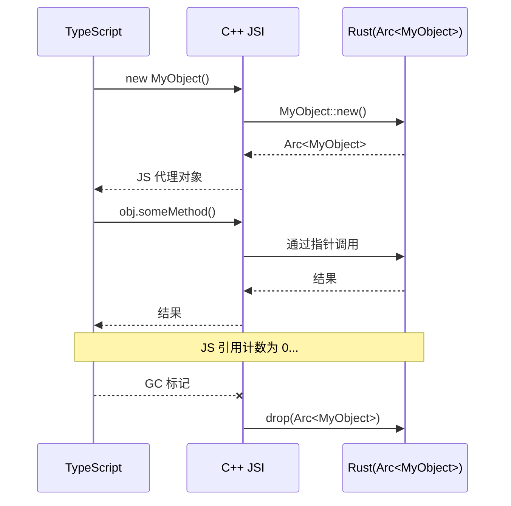

# 类型映射 Rust ↔ TypeScript

uniffi 的类型系统是用 ubrn 写 Rust API 时的核心知识。下面按"类型范畴"展开。

## 标量类型

| Rust | TypeScript | 备注 |
|------|-----------|------|
| `u8` / `u16` / `u32` | `number` | 仅正整数 |
| `i8` / `i16` / `i32` | `number` | |
| `f32` / `f64` | `number` | |
| `u64` / `i64` | `bigint` | 超过 `Number.MAX_SAFE_INTEGER`,用 `BigInt` |
| `bool` | `boolean` | |
| `String` | `string` | UTF-8 |

> **`bigint` 是契约**。返回 `u64` 的函数 TS 端必须 `0n` / `BigInt(x)` 调用,直接传 `0` 报类型错。

## 其他简单类型

| Rust | TypeScript | 备注 |
|------|-----------|------|
| `Vec<u8>` | `ArrayBuffer` | 二进制高效传输(JSI 直通) |
| `std::time::SystemTime` | `Date` | 别名 `UniffiTimestamp` |
| `std::time::Duration` | `number` (ms) | 别名 `UniffiDuration` |

> **`chrono::DateTime<Utc>` 怎么办?** uniffi 本身**不**支持 chrono——把它转 `SystemTime` 暴露给 FFI,或者写自定义类型转换(`uniffi.toml`)。

## 结构性类型

| Rust | TypeScript | 备注 |
|------|-----------|------|
| `Option<T>` | `T \| undefined` | |
| `Vec<T>` | `Array<T>` | 最大长度 2³¹ - 1 |
| `HashMap<K, V>` / `BTreeMap<K, V>` | `Map<K, V>` | 最大长度 2³¹ - 1 |

## Records:值类型(按值传递,无方法)

```rust
#[derive(uniffi::Record)]
struct UserMeta {
    user_id: String,
    display_name: String,
    #[uniffi(default = 0)]
    score: u64,
}
```

生成的 TS:

```typescript
type UserMeta = {
    userId: string;              // snake_case → camelCase 自动
    displayName: string;
    score: bigint;
};

// 工厂函数处理默认值
const UserMeta = {
    create(fields: { userId: string; displayName: string; score?: bigint }): UserMeta,
    defaults(): Partial<UserMeta>,
};

const meta = UserMeta.create({ userId: "abc", displayName: "Alice" });
// score 自动用默认 0n
```

要点:

- **命名转换**:Rust `snake_case` → TS `camelCase`,自动且不可关闭
- **默认值**用 `#[uniffi(default = …)]` 注解,接受字面量
- **嵌套 Record**:字段类型也是 Record 时,会递归生成 TS 类型

## Objects:引用类型(按引用传递,有方法)

```rust
#[derive(uniffi::Object)]
struct NetworkManager {
    peers: Mutex<Vec<String>>,
}

#[uniffi::export]
impl NetworkManager {
    // 主构造函数:JS 端 new NetworkManager()
    #[uniffi::constructor]
    fn new() -> Arc<Self> {
        Arc::new(Self { peers: Mutex::new(vec![]) })
    }

    // 命名构造函数:JS 端 NetworkManager.withBootstrap(...)
    #[uniffi::constructor(name = "with_bootstrap")]
    fn with_bootstrap(nodes: Vec<String>) -> Arc<Self> {
        Arc::new(Self { peers: Mutex::new(nodes) })
    }

    fn peer_count(&self) -> u32 {
        self.peers.lock().unwrap().len() as u32
    }

    fn add_peer(&self, peer_id: String) {
        self.peers.lock().unwrap().push(peer_id);
    }
}
```

生成的 TS:

```typescript
// 配套 interface,用于 mock + 作为函数参数/返回类型
interface NetworkManagerInterface {
    peerCount(): number;
    addPeer(peerId: string): void;
}

class NetworkManager implements NetworkManagerInterface {
    constructor();
    static withBootstrap(nodes: string[]): NetworkManager;
    peerCount(): number;
    addPeer(peerId: string): void;
    uniffiDestroy(): void;        // 手动释放 Rust 资源
    uniffiUse<R>(fn: (self: this) => R): R;  // RAII 风格自动释放
}
```

### `${OBJECT_NAME}Interface` 的用途

uniffi 会自动给每个 `#[derive(uniffi::Object)]` 生成一个同名 interface(`MyObject` → `MyObjectInterface`)。

- 当 Rust 函数返回 `MyObject` 时,TS 端**返回类型用 `MyObjectInterface`**(便于 mock)
- 实例方法签名也用 interface 形式
- 要关掉这个行为,在 `uniffi.toml` 配置(见上游 docs `reference/uniffi-toml.md`)

```typescript
function myObject(): MyObjectInterface              // 返回类型用 interface
```

### Trait 自动映射

实现下列 Rust trait,会自动在 TS 端生成对应方法:

| Rust trait | TS 方法 | 返回类型 |
|------------|---------|----------|
| `Display` | `toString()` | `string` |
| `Debug` | `toDebugString()` | `string` |
| `Eq` | `equals(other)` | `boolean` |
| `Hash` | `hashCode()` | `bigint` |
| `Ord` | `compareTo(other)` | `number`(-1/0/1) |

### Object 生命周期与 GC



详见 [error-memory-threading.md](error-memory-threading.md) 的"内存管理"节。

## Enums:简单枚举

```rust
#[derive(uniffi::Enum)]
enum SyncStatus {
    Idle,
    Syncing,
    Synced,
    Failed,
}
```

```typescript
enum SyncStatus {
    Idle,
    Syncing,
    Synced,
    Failed,
}
const s = SyncStatus.Syncing;
```

### 带判别值的简单枚举

```rust
#[derive(uniffi::Enum)]
pub enum Priority {
    Low = 1,
    Medium = 2,
    High = 3,
}
```

```typescript
enum Priority { Low = 1, Medium = 2, High = 3 }
```

## Enums:Tagged Union(带数据的枚举)

Rust 的 algebraic data type 是最强大的类型工具之一,uniffi 把它映射为 TS 的 discriminated union。

```rust
#[derive(uniffi::Enum)]
enum NetworkEvent {
    Connected,                                                // 无数据
    Progress(u32, u32),                                       // 位置参数(tuple)
    PeerDiscovered { peer_id: String, name: String },         // 命名参数
    Error { message: String },
}
```

生成 TS:

```typescript
// 标签枚举
enum NetworkEvent_Tags {
    Connected,
    Progress,
    PeerDiscovered,
    Error,
}

// 联合类型
type NetworkEvent =
    | { tag: NetworkEvent_Tags.Connected }
    | { tag: NetworkEvent_Tags.Progress; inner: [number, number] }
    | { tag: NetworkEvent_Tags.PeerDiscovered; inner: { peerId: string; name: string } }
    | { tag: NetworkEvent_Tags.Error; inner: { message: string } };

// 构造器
const e1 = new NetworkEvent.Connected();
const e2 = new NetworkEvent.Progress(10, 100);
const e3 = new NetworkEvent.PeerDiscovered({ peerId: "abc", name: "Alice's iPhone" });

// 模式匹配(switch + 标签)
switch (event.tag) {
    case NetworkEvent_Tags.Progress: {
        const [done, total] = event.inner;
        console.log(`${done}/${total}`);
        break;
    }
    case NetworkEvent_Tags.PeerDiscovered: {
        console.log(event.inner.name);
        break;
    }
}

// 类型守卫(更精确的判断)
if (NetworkEvent.Error.instanceOf(event)) {
    console.error(event.inner.message);
}
```

### 怎么选 tagged union vs 多个独立类型?

- **强烈推荐 tagged union**——`switch (event.tag)` 在 TS 里有完整的 exhaustiveness 检查,前端少写大量 `if (e.type === ...)`
- 多个独立类型适合"事件源完全不同"的场景,但通常 newtype + 内部 enum 更整洁

## 错误类型

错误是特殊形态的 enum,详见 [error-memory-threading.md](error-memory-threading.md)。

```rust
#[derive(uniffi::Error)]
pub enum AppError {
    NotFound,
    InvalidInput { reason: String },
    Internal,
}
```

在 TS 端 `instanceof Error === true`,可以 `throw`,有 `instanceOf` 静态方法判别。

## `#[uniffi::export]` 修饰

| 修饰 | 作用 |
|------|------|
| `#[uniffi::export]` | 顶层函数 / impl 块 |
| `#[uniffi::export(async_runtime = "tokio")]` | impl 块含 async fn 且依赖 tokio reactor 时必加 |
| `#[uniffi::export(callback_interface)]` | trait 仅由 JS 实现传给 Rust(`Box<dyn T>`) |
| `#[uniffi::export(with_foreign)]` | trait 可由 Rust 或 JS 实现(`Arc<dyn T>`) |
| `#[uniffi::constructor]` | 默认构造函数(JS 端 `new MyObject()`) |
| `#[uniffi::constructor(name = "...")]` | 命名构造函数(JS 端 `MyObject.create(...)`) |

## 命名规则

| Rust | TS |
|------|-----|
| `snake_case` fn 名 | `camelCase` |
| `snake_case` 字段名 | `camelCase` |
| `PascalCase` 类型名 | `PascalCase` |
| `SCREAMING_CASE` 常量 | 保留 |
| `Self::method` | 实例方法 |
| `Self::with_*`(构造) | `static withX(...)` |

> 不可关闭。即使加 `#[serde(rename = "...")]` 也不会影响 uniffi 输出(uniffi 不读 serde 属性)。

## 跨 FFI 边界的类型不支持时怎么办?

uniffi **不**支持任意第三方类型(libp2p `PeerId` / `Multiaddr` / SeaORM `Model` / 任意外部 enum)。

**通用解法**——在 FFI 边界做投影,把外部类型转为 uniffi 友好类型:

```rust
// ❌ 不行
#[uniffi::export]
pub fn connect(peer_id: libp2p::PeerId) { ... }

// ✅ 在 FFI 边界传 String,内部 parse
#[uniffi::export]
pub fn connect(peer_id: String) -> Result<(), AppError> {
    let peer_id: libp2p::PeerId = peer_id.parse()
        .map_err(|e| AppError::InvalidInput { reason: format!("{e}") })?;
    // 内部用真实类型
    Ok(())
}
```

对于复杂类型,在 wrap 层定义独立 `uniffi::Record`,从 core 类型 `From<CoreType>` 转换。详见 [build-pitfalls.md](build-pitfalls.md) 与 [multi-crate-and-publish.md](multi-crate-and-publish.md)。

## 自定义类型转换(`uniffi.toml`)

如果你想让某个外部类型(如 `url::Url`)直接以"对应原生类型"出现,可以在 `uniffi.toml` 写 custom type:

```toml
[bindings.typescript.custom_types.Url]
type_name = "string"        # TS 端类型
into_custom = "({}).toString()"
try_from_custom = "new URL({})"
```

详见上游 [reference/uniffi-toml.md](https://jhugman.github.io/uniffi-bindgen-react-native/reference/uniffi-toml.html)。一般场景**不必**配,投影 String 已足够。

## 相关
- [async-and-callbacks.md](async-and-callbacks.md) — `async fn` / `callback_interface` / `Foreign Trait`
- [error-memory-threading.md](error-memory-threading.md) — `uniffi::Error` 与 Object 生命周期
- [build-pitfalls.md](build-pitfalls.md) — Rust 类型设计与外部库类型边界
